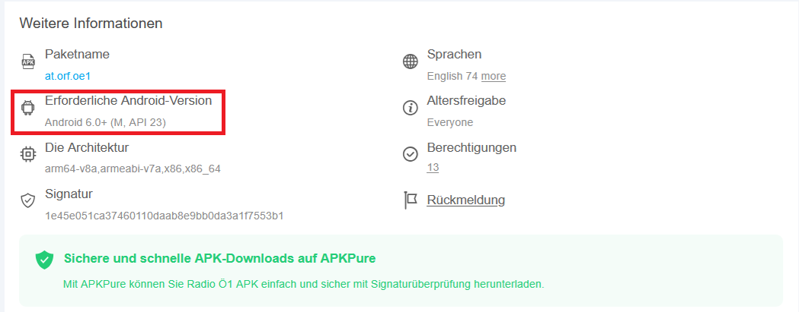
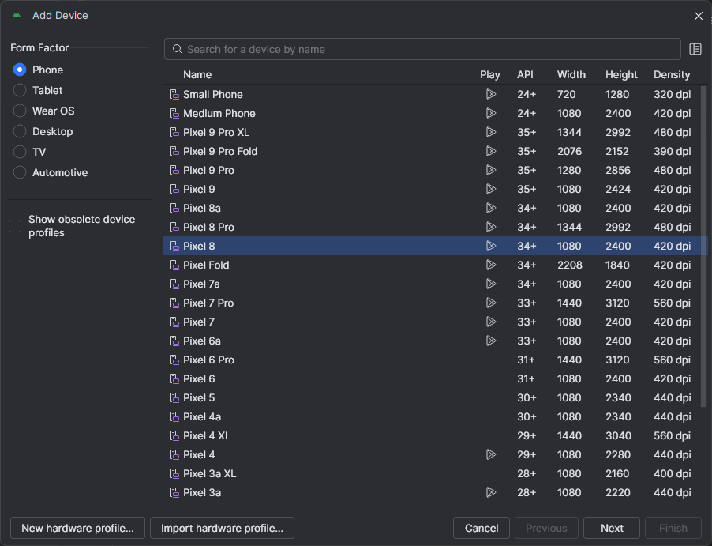
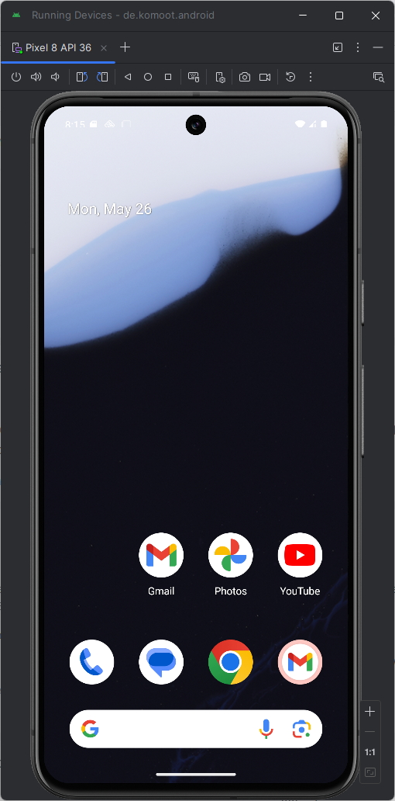
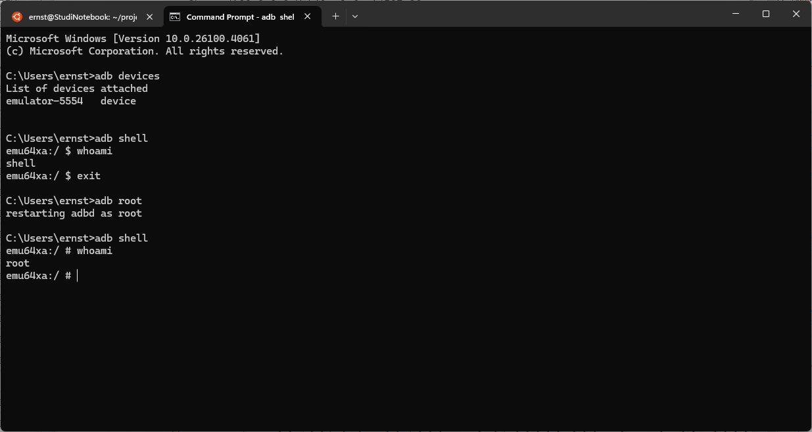
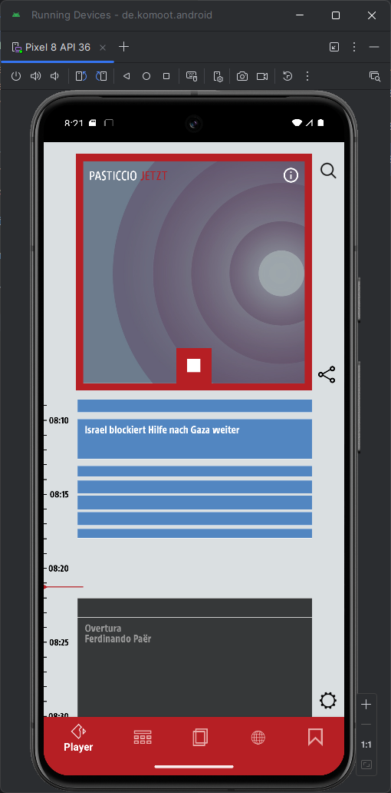
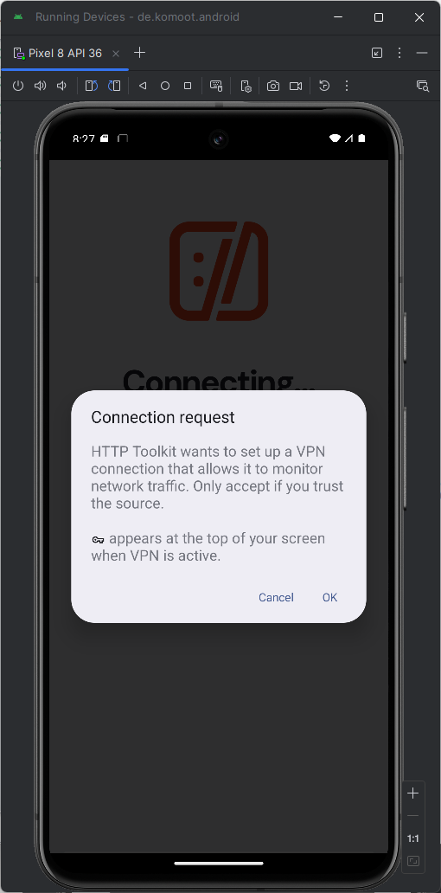
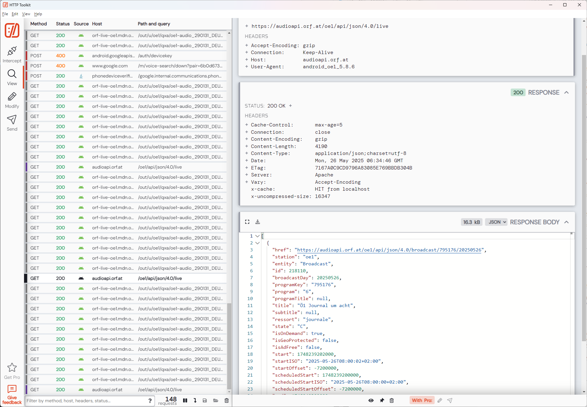

Student: Ernst Schwaiger
Date 2025-05-25

# Lab + App Network Traffic Inspection/Interception Setup

## Install Lab
Installing Lab on Native Windows 11 OS

Download and install "Android Studio Meerkat Feature Drop | 2024.3.2" from https://developer.android.com/studio
Download commandlinetools-win-13114758_latest.zip from the same website

When installing Android Studio, the Sdk Tools are installed to `C:\Users\<username>\AppData\Local\Android\Sdk`
Add `C:\Users\<username>\AppData\Local\Android\Sdk\emulator` to PATH environment variable so that the
Android Debug Bridge `adb` can be invoked from anywhere in a Windows command prompt.

Download and install HTTP toolkit from https://httptoolkit.com/docs/guides/android/

## Install Emulator and App, Install HTTP toolkit System Certificate

The Android App to analyze is the OE1 App, which can be downloaded from https://apkpure.com/de/radio-%C3%B61/at.orf.oe1/download.
The download page shows that the app is built on API 23, indicating that it will accept system certificates (but no user certificates) when setting up TLS connections:

In Android Studio, go to `Tools/Device Manager`, press the '+' button to create a new virtual device.
Leave the "Form Factor" as "Phone", select an emulator for a phone supporting at least API 23,
e.g. one of the "Pixel" series, then press the "Next" button.

In the next window, ensure that the selected API is at least 23 and change the "Services" Combo Box
to from "Google Play Store" to "Google APIs", which ensures that the emulator can be run in root mode (see also: https://www.repeato.app/resolving-adb-root-is-not-working-on-emulator-issue/),
which is required for installing system certificates. As Image, select "Google APIs Intel x86_64 Atom System Image", press finish and confirm the download of the Image.

After download, the added virtual device shows up in the device list and can be started by pressing the "play" triangle button. After a few seconds, the virtual device has booted.

For obtaining root access on the vertual device, start a Windows command prompt and run `adb shell`, providing a shell into the virtual device. The command `whoami` indicates the user by which the virtual device is run. If it is not `root`, exit the shell, run `adb root` and `adb shell` again. The user should now be `root`

The OE1 app can be installed by dragging the downloaded .apk file directly onto the virtual device, then dropping it. In order to start the app, click its icon, then configure cookie and
standby settings arbitrarily.

Launch httptoolkit to observe the traffic of the running app, in the main window, select "Android Device via ADB". On the virtual device a "Connection Request" Pop-up shows the connection request of HTTP toolkit, which is accepted by pressing "OK". 

In the subsequent window, allow HTTP toolkit to also send notifications to the virtual device. HTTP toolkit confirms that it is now connected to the virtual device, i.e. all incoming and outgoing network traffic on it goes through HTTP toolkit.

Since the certificate of HTTP toolkit is installed on the virtual device, the OE1 app trusts it, and the traffic data can be monitored in clear text in the HTTP toolkit main window:

Download platform-tools-latest-windows.zip from https://developer.android.com/tools/releases/platform-tools,
extract the contents to `C:\Users\<username>\platform-tools` and add that folder to the PATH environment variable

Download and install apktool from https://apktool.org/docs/install/ to `C:\Users\<username>\apktool`, add the .bat wrapper script,
ensure `%JAVA_HOME%` is set as environment variable and refers to a Java JDK installation.

Download and install jadx from https://github.com/skylot/jadx (Not yet done)

Install certificate on android (must be a root certificate)
https://www.repeato.app/resolving-adb-root-is-not-working-on-emulator-issue/
(Use an emulator which is not in production mode)

Create an Image for a Pixel 9 emulator, select Google APIs (not Google Play)

NSC... Network Security Configuration (Google), introduced in Android 7.

