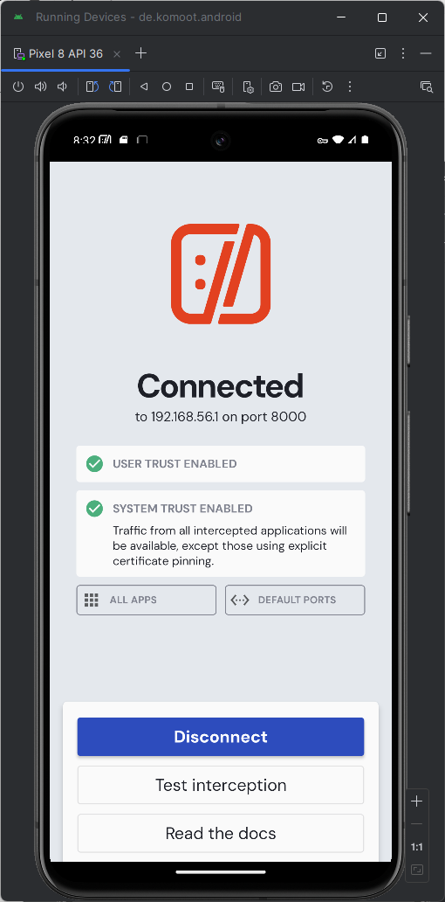

Ernst Schwaiger
Date 2025-05-25 - 2025-06-01

# Lab + App Network Traffic Inspection/Interception Setup

## Install Lab
Installing Lab on Native Windows 11 OS

Download and install "Android Studio Meerkat Feature Drop | 2024.3.2" from https://developer.android.com/studio.

Add `C:\Users\<username>\AppData\Local\Android\Sdk\emulator` to PATH environment variable so that the
Android Debug Bridge `adb` can be invoked from anywhere in a Windows command prompt.

Download and install HTTP toolkit from https://httptoolkit.com/docs/guides/android/

## Install Emulator and App, Install HTTP toolkit System Certificate

The Android App to analyze is the OE1 App, Version 5.8.6, which can be downloaded from https://apkpure.com/de/radio-%C3%B61/at.orf.oe1/download.
The download page shows that the app is built on API 23, indicating that it will accept system certificates (but no user certificates) when setting up TLS connections:


In Android Studio, go to `Tools/Device Manager`, press the '+' button to create a new virtual device.
Leave the "Form Factor" as "Phone", select an emulator for a phone supporting at least API 23,
e.g. one of the "Pixel" series, then press the "Next" button.


In the next window, ensure that the selected API is at least 23 and change the "Services" Combo Box
to from "Google Play Store" to "Google APIs", which ensures that the emulator can be run in root mode (see also: https://www.repeato.app/resolving-adb-root-is-not-working-on-emulator-issue/),
which is required for installing system certificates. As Image, select "Google APIs Intel x86_64 Atom System Image", press finish and confirm the download of the image.

After download, the added virtual device shows up in the device list and can be started by pressing the "play" triangle button. After a few seconds, the virtual device has booted.


For obtaining root access on the virtual device, start a Windows command prompt and run `adb shell`, providing a shell into the virtual device. The command `whoami` indicates the user by which the virtual device is run. If it is not `root`, exit the shell, run `adb root` and `adb shell` again. The user should now be `root`


The OE1 app can be installed by dragging the downloaded .apk file directly onto the virtual device, then dropping it. In order to start the app, click its icon, then configure cookie and
standby settings arbitrarily.


Launch httptoolkit to observe the traffic of the running app, in the main window, select "Android Device via ADB". On the virtual device a "Connection Request" Pop-up shows the connection request of HTTP toolkit, which is accepted by pressing "OK". 


In the subsequent window, allow HTTP toolkit to also send notifications to the virtual device. HTTP toolkit confirms that it is now connected to the virtual device, i.e. all incoming and outgoing network traffic on it goes through HTTP toolkit.



Since the certificate of HTTP toolkit is installed on the virtual device, the OE1 app trusts it, and the traffic data can be monitored in clear text in the HTTP toolkit main window:


# Perform Static and Dynamic Analysis

Download and install jadx v1.5.1 from https://github.com/skylot/jadx/releases/download/v1.5.1/jadx-1.5.1.zip.
Decompile the application executing `./jadx-1.5.1/bin/jadx 'Radio Ö1_5.8.6_APKPure.apk'`. The byte code is decompiled to Java.

## Inspect the code

### How is HTTP(S) implemented?

In the decompiled code, https://github.com/square/okhttp can be found in `sources`. The installed version was retrieved via `cat sources/okhttp3/OkHttp.java`:

```java
package okhttp3;

import kotlin.Metadata;

/* compiled from: OkHttp.kt */
// ...
/* loaded from: classes5.dex */
public final class OkHttp {
    public static final OkHttp INSTANCE = new OkHttp();
    public static final String VERSION = "4.9.1";

    private OkHttp() {
    }
}
```

The `OkHttp` library is written in Kotlin, and publicly available on `https://github.com/square/okhttp`. Any further code inspection on 
that library in that particular version was done using the actual source code instead of the decompiled Java code. 

Clients of the `OkHttp` library have to access an instance of `OkHttpClient`, the clients in the OE1 app can therefore be found via
```bash
find sources -name "*.java" | xargs grep -il "OkHttpClient" | grep -v "okhttp3"
sources/at/orf/android/orfaudioplayer/api/Cluboe3Kt.java
sources/at/orf/oe1/di/FlipsideNetworkModuleKt.java
sources/at/orf/oe1/di/PushNetworkModuleKt.java
sources/at/orf/oe1/di/RabNetworkModuleKt.java
sources/at/orf/oe1/di/RadioNetworkModuleKt.java
sources/at/orf/oe1/di/StoryNetworkModuleKt.java
sources/at/orf/oe1/legacy/message/MessageToOe3Request.java
sources/de/infonline/lib/iomb/q0.java
sources/retrofit2/Retrofit.java
```

For processing HTTP, the `Retrofit` library, `https://github.com/square/retrofit`, is included as well. 
It is built on top of `OkHttp` and used by these client classes:

```bash
sources/de/infonline/lib/iomb/q0.java
sources/at/orf/android/orfaudioplayer/api/Cluboe3Kt.java
sources/at/orf/oe1/di/RadioNetworkModuleKt.java
sources/at/orf/oe1/di/StoryNetworkModuleKt.java
sources/at/orf/oe1/di/FlipsideNetworkModuleKt.java
sources/at/orf/oe1/di/PushNetworkModuleKt.java
sources/at/orf/oe1/di/RabNetworkModuleKt.java
```

### Which TLS versions and cipher suites are supported?

`ConnectionSpec.kt` contains several several sets of cipher suites that can be used by clients, in conjunction with the supported
TLS versions:

```kotlin
// ...

  @Suppress("DEPRECATION")
  companion object {
    // Most secure but generally supported list.
    private val RESTRICTED_CIPHER_SUITES = arrayOf(
        // TLSv1.3.
        CipherSuite.TLS_AES_128_GCM_SHA256,
        CipherSuite.TLS_AES_256_GCM_SHA384,
        CipherSuite.TLS_CHACHA20_POLY1305_SHA256,

        // TLSv1.0, TLSv1.1, TLSv1.2.
        CipherSuite.TLS_ECDHE_ECDSA_WITH_AES_128_GCM_SHA256,
        CipherSuite.TLS_ECDHE_RSA_WITH_AES_128_GCM_SHA256,
        CipherSuite.TLS_ECDHE_ECDSA_WITH_AES_256_GCM_SHA384,
        CipherSuite.TLS_ECDHE_RSA_WITH_AES_256_GCM_SHA384,
        CipherSuite.TLS_ECDHE_ECDSA_WITH_CHACHA20_POLY1305_SHA256,
        CipherSuite.TLS_ECDHE_RSA_WITH_CHACHA20_POLY1305_SHA256)

    // This is nearly equal to the cipher suites supported in Chrome 72, current as of 2019-02-24.
    // See https://tinyurl.com/okhttp-cipher-suites for availability.
    private val APPROVED_CIPHER_SUITES = arrayOf(
        // TLSv1.3.
        CipherSuite.TLS_AES_128_GCM_SHA256,
        CipherSuite.TLS_AES_256_GCM_SHA384,
        CipherSuite.TLS_CHACHA20_POLY1305_SHA256,

        // TLSv1.0, TLSv1.1, TLSv1.2.
        CipherSuite.TLS_ECDHE_ECDSA_WITH_AES_128_GCM_SHA256,
        CipherSuite.TLS_ECDHE_RSA_WITH_AES_128_GCM_SHA256,
        CipherSuite.TLS_ECDHE_ECDSA_WITH_AES_256_GCM_SHA384,
        CipherSuite.TLS_ECDHE_RSA_WITH_AES_256_GCM_SHA384,
        CipherSuite.TLS_ECDHE_ECDSA_WITH_CHACHA20_POLY1305_SHA256,
        CipherSuite.TLS_ECDHE_RSA_WITH_CHACHA20_POLY1305_SHA256,

        // Note that the following cipher suites are all on HTTP/2's bad cipher suites list. We'll
        // continue to include them until better suites are commonly available.
        CipherSuite.TLS_ECDHE_RSA_WITH_AES_128_CBC_SHA,
        CipherSuite.TLS_ECDHE_RSA_WITH_AES_256_CBC_SHA,
        CipherSuite.TLS_RSA_WITH_AES_128_GCM_SHA256,
        CipherSuite.TLS_RSA_WITH_AES_256_GCM_SHA384,
        CipherSuite.TLS_RSA_WITH_AES_128_CBC_SHA,
        CipherSuite.TLS_RSA_WITH_AES_256_CBC_SHA,
        CipherSuite.TLS_RSA_WITH_3DES_EDE_CBC_SHA)

    /** A secure TLS connection that requires a recent client platform and a recent server. */
    @JvmField
    val RESTRICTED_TLS = Builder(true)
        .cipherSuites(*RESTRICTED_CIPHER_SUITES)
        .tlsVersions(TlsVersion.TLS_1_3, TlsVersion.TLS_1_2)
        .supportsTlsExtensions(true)
        .build()

    /**
     * A modern TLS configuration that works on most client platforms and can connect to most servers.
     * This is OkHttp's default configuration.
     */
    @JvmField
    val MODERN_TLS = Builder(true)
        .cipherSuites(*APPROVED_CIPHER_SUITES)
        .tlsVersions(TlsVersion.TLS_1_3, TlsVersion.TLS_1_2)
        .supportsTlsExtensions(true)
        .build()

    /**
     * A backwards-compatible fallback configuration that works on obsolete client platforms and can
     * connect to obsolete servers. When possible, prefer to upgrade your client platform or server
     * rather than using this configuration.
     */
    @JvmField
    val COMPATIBLE_TLS = Builder(true)
        .cipherSuites(*APPROVED_CIPHER_SUITES)
        .tlsVersions(TlsVersion.TLS_1_3, TlsVersion.TLS_1_2, TlsVersion.TLS_1_1, TlsVersion.TLS_1_0)
        .supportsTlsExtensions(true)
        .build()

    /** Unencrypted, unauthenticated connections for `http:` URLs. */
    @JvmField
    val CLEARTEXT = Builder(false).build()
  }
}
```

- The `RESTRICTED_TLS` supports the most popular cipher suites considered secure in conjunction with TLS 1.2 and 1.3.
- The `MODERN_TLS` supports additional cipher suites that are considered "weak" either due to missing forward secrecy,
or the usage of the vulnerable CBC mode or the usage of the insecure SHA1 hashing function.
- The `COMPATIBLE_TLS` supports the same cipher suites as `MODERN_TLS`, but additionally allows TLS 1.0 and 1.2

At runtime the "client hello" message only offers TLS 1.2 and 1.3, and the cipher suites listed in `APPROVED_CIPHER_SUITES`, indicating that the client
is using the `MODERN_TLS` variant. Interestingly `CipherSuite.TLS_RSA_WITH_3DES_EDE_CBC_SHA` is not offered by the client, which is very reasonable. 
But the author of this protocol was not able to pinpoint the code that actually prevents this cipher suite from being offered.


### Is a Network Security Configuration (NSC) used?

The manifest file `./resources/AndroidManifest.xml` refers via `android:networkSecurityConfig="@xml/security"` to a security.xml file:

```xml
<?xml version="1.0" encoding="utf-8"?>
<manifest xmlns:android="http://schemas.android.com/apk/res/android"
    android:versionCode="16122794"
    android:versionName="5.8.6"
    android:compileSdkVersion="34"
    android:compileSdkVersionCodename="14"
    package="at.orf.oe1"
    platformBuildVersionCode="34"
    platformBuildVersionName="14">
    <!-- ... -->
    <application
        android:theme="@style/AppTheme"
        android:label="@string/app_name"
        android:icon="@mipmap/ic_launcher"
        android:name="at.orf.oe1.BaseApplication"
        android:allowBackup="false"
        android:supportsRtl="true"
        android:extractNativeLibs="false"
        android:networkSecurityConfig="@xml/security"
```
    
`security.xml` allows plain text communication in general:

```xml
<?xml version="1.0" encoding="utf-8"?>
<network-security-config>
    <base-config cleartextTrafficPermitted="true"/>
    <domain-config cleartextTrafficPermitted="true">
        <domain includeSubdomains="true">mp3stream7.apasf.apa.at
        </domain>
        <domain includeSubdomains="true">loopstreamoe3.apa.at
        </domain>
    </domain-config>
</network-security-config>
```

The authors guess for that peculiar configuration is that the OE1 app transmits the audio streams unencrypted. All other connections to remote hosts, however, are encrypted.


### Is Certificate Pinning implemented?

The `security.xml` does not have certificate pinning configured. `OKHttp` provides their own certificate
pinning support in `CertificatePinner.kt`, suggesting the following demo code in which the hashes of the
elements of the pinned certificate chain for `publicobject.com` must be added:

```kotlin
String hostname = "publicobject.com";
CertificatePinner certificatePinner = new CertificatePinner.Builder()
    .add(hostname, "sha256/<base32_encoded_hash_ofpubkey_1>")
    // ...
    .add(hostname, "sha256/<base32_encoded_hash_ofpubkey_n>")
    .build();
OkHttpClient client = OkHttpClient.Builder()
    .certificatePinner(certificatePinner)
    .build();

Request request = new Request.Builder()
    .url("https://" + hostname)
    .build();
client.newCall(request).execute();
```

Since no such code (i.e. no instantiation of `CertificatePinner`) was found in the client, the author concludes that certificate pinning is not implemented in the app.

### Semgrep

Installed semgrep as docker container via `docker pull semgrep/semgrep`. Running
`docker run -e --rm -v "${PWD}/sources:/src" semgrep/semgrep semgrep scan --config auto .` yielded ~80 warnings of the following categories:


    ❯❱ java.lang.security.audit.active-debug-code-getstacktrace.active-debug-code-getstacktrace
    ❯❱ java.lang.security.audit.active-debug-code-printstacktrace.active-debug-code-printstacktrace
    ❯❱ java.lang.security.audit.bad-hexa-conversion.bad-hexa-conversion
    ❯❱ java.lang.security.audit.crypto.unencrypted-socket.unencrypted-socket
    ❯❱ java.lang.security.audit.crypto.use-of-md5.use-of-md5
    ❯❱ java.lang.security.audit.crypto.use-of-sha1.use-of-sha1
    ❯❱ java.lang.security.audit.crypto.weak-random.weak-random
    ❯❱ java.lang.security.audit.object-deserialization.object-deserialization
    ❯❱ java.lang.security.audit.unsafe-reflection.unsafe-reflection
    ❯❱ java.lang.security.audit.weak-ssl-context.weak-ssl-context
    ❯❯❱ java.lang.security.audit.xxe.documentbuilderfactory-disallow-doctype-decl-missing.documentbuilderfactory-disallow-doctype-decl-missing
    ❯❯❱ java.lang.security.xxe.saxtransformerfactory-xxe-stylesheet.saxtransformerfactory-xxe-stylesheet
    ❯❯❱ java.lang.security.xxe.saxtransformerfactory-xxe.saxtransformerfactory-xxe

The most serious warnings:
- `java.lang.security.audit.xxe.documentbuilderfactory-disallow-doctype-decl-missing.documentbuilderfactory-disallow-doctype-decl-missing`
- `java.lang.security.xxe.saxtransformerfactory-xxe-stylesheet.saxtransformerfactory-xxe-stylesheet`
- `java.lang.security.xxe.saxtransformerfactory-xxe.saxtransformerfactory-xxe`

were found in `com/googlecode/mp4parser/authoring/tracks/ttml/TtmlHelpers.java` and refer to the creation of the `TtmlTrackImpl` and `Transformer` instances in the code below. 
It seems that in the mp4 parser library some debugging code was left behind, i.e. the
`main()` function should have been removed before releasing the library.
The `getAllNamespaces()` function applies an XML style sheet defined in `namespacesStyleSheet1` on a passed XML Document to extract the namespaces used in it. The style sheet code was most likely copy/pasted from Stack Overflow `https://stackoverflow.com/questions/3747049/how-to-get-a-list-of-all-used-namespaces`, but likely can't be exploited.

```java
// ...
public class TtmlHelpers {
    public static final String SMPTE_TT_NAMESPACE = "http://www.smpte-ra.org/schemas/2052-1/2010/smpte-tt";
    public static final String TTML_NAMESPACE = "http://www.w3.org/ns/ttml";
    static byte[] namespacesStyleSheet1 = "<xsl:stylesheet version=\"1.0\" xmlns:xsl=\"http://www.w3.org/1999/XSL/Transform\">\n    <xsl:output method=\"text\"/>\n    <xsl:key name=\"kElemByNSURI\"\n             match=\"*[namespace::*[not(. = ../../namespace::*)]]\"\n              use=\"namespace::*[not(. = ../../namespace::*)]\"/>\n    <xsl:template match=\"/\">\n        <xsl:for-each select=\n            \"//namespace::*[not(. = ../../namespace::*)]\n                           [count(..|key('kElemByNSURI',.)[1])=1]\">\n            <xsl:value-of select=\"concat(.,'&#xA;')\"/>\n        </xsl:for-each>\n    </xsl:template>\n</xsl:stylesheet>".getBytes();
    public static final NamespaceContext NAMESPACE_CONTEXT = new TextTrackNamespaceContext(null);

    public static void main(String[] strArr) throws URISyntaxException, ParserConfigurationException, IOException, SAXException, XPathExpressionException, TransformerException {
        DocumentBuilderFactory newInstance = DocumentBuilderFactory.newInstance();
        newInstance.setNamespaceAware(true);
        TtmlTrackImpl ttmlTrackImpl = new TtmlTrackImpl("a.xml", TtmlSegmenter.split(newInstance.newDocumentBuilder().parse("C:\\dev\\mp4parser\\a.xml"), 60));
        Movie movie = new Movie();
        movie.addTrack(ttmlTrackImpl);
        new DefaultMp4Builder().build(movie).writeContainer(new FileOutputStream("output.mp4").getChannel());
    }

    public static String[] getAllNamespaces(Document document) {
        try {
            Transformer newTransformer = TransformerFactory.newInstance().newTransformer(new StreamSource(new ByteArrayInputStream(namespacesStyleSheet1)));
            StringWriter stringWriter = new StringWriter();
            newTransformer.transform(new DOMSource(document), new StreamResult(stringWriter));
            ArrayList arrayList = new ArrayList(new LinkedHashSet(Arrays.asList(stringWriter.getBuffer().toString().split("\n"))));
            return (String[]) arrayList.toArray(new String[arrayList.size()]);
        } catch (TransformerConfigurationException e) {
            throw new RuntimeException(e);
        } catch (TransformerException e2) {
            throw new RuntimeException(e2);
        }
    }
    // ...
```

Both reported methods are only invoked internally in the mp4parser library, and none of that code is called from somewhere else, so both methods can be considered "dead code".


In the package `at.orf.*`, containing the app code, only occurrences of 
- `java.lang.security.audit.active-debug-code-printstacktrace.active-debug-code-printstacktrace` and 
- `java.lang.security.audit.bad-hexa-conversion.bad-hexa-conversion` were found.

The `OrfAdParameter.md5()` function was reported for both violations. In the catch clause, the exception stack trace is written to `stderr` and an empty string is returned instead of the hash instead. Both are dangerous actions, but the catch handler would only execute if the "MD5" function was not available (it always is). The second warning relates to the building of the MD5 string value

```java
    private final String md5(String s) {
        try {
            MessageDigest messageDigest = MessageDigest.getInstance("MD5");
            byte[] bytes = s.getBytes(Charsets.UTF_8);
            Intrinsics.checkNotNullExpressionValue(bytes, "getBytes(...)");
            messageDigest.update(bytes);
            byte[] digest = messageDigest.digest();
            StringBuffer stringBuffer = new StringBuffer();
            for (byte b : digest) {
                stringBuffer.append(Integer.toHexString(b & 255));
            }
            String stringBuffer2 = stringBuffer.toString();
            Intrinsics.checkNotNullExpressionValue(stringBuffer2, "toString(...)");
            return stringBuffer2;
        } catch (NoSuchAlgorithmException e) {
            e.printStackTrace();
            return "";
        }
    }
```

which has a bug in it, since `Integer.toHexString()` will generate single digit hex strings for byte values in the range `[0x00..0x0f]`, instead of double-digit hex strings starting with `0`. This does not constitute a vulnerability since the function is only executed once on a string controlled by the application.

### Manual Grepping

Grepping for interesting keywords revealed:

```bash
find sources/at -name "*.java" | xargs grep "api_key"
sources/at/orf/oe1/R.java:        public static final int google_api_key = 0x7f140189;
sources/at/orf/oe1/R.java:        public static final int google_crash_reporting_api_key = 0x7f14018b;
```

It turned out that these IDs just refer to ordinary text strings, not to actual Google API keys. Celebrated too early :-).

```xml
    <!-- ... -->
    <public type="string" name="google_api_key" id="0x7f140189" />
    <public type="string" name="google_app_id" id="0x7f14018a" />
    <public type="string" name="google_crash_reporting_api_key" id="0x7f14018b" />
    <!-- ... -->
```

No hard-coded keys, access tokens or similar items were found in the decompiled app.

### Looking for Vulnerabilities in Open Source Repositories

`https://nvd.nist.gov/vuln/search/results?form_type=Basic&results_type=overview&query=OkHttp&search_type=all&isCpeNameSearch=false` only show vulnerabilities for `OkHttp` Versions 2.x and 3.x

`https://nvd.nist.gov/vuln/search/results?form_type=Basic&results_type=overview&query=retrofit+Square&search_type=all&isCpeNameSearch=false` shows two vulnerabilities for Versions 2.0 and 3.0. 

- `https://nvd.nist.gov/vuln/detail/CVE-2018-1000850` was fixed in `https://github.com/square/retrofit/commit/b9a7f6ad72073ddd40254c0058710e87a073047d`, which is contained in the OE1 app.

- `https://nvd.nist.gov/vuln/detail/CVE-2018-1000844` was fixed in `https://github.com/square/retrofit/commit/4a693c5aeeef2be6c7ecf80e7b5ec79f6ab59437`, the vulnerable Java class `JaxbResponseConverter.java` is not contained in the OE1 app.

None of the listed vulnerabilities is active in the OE1 app.

## Dynamic Analysis

Intercepted by `HttpToolkit`, the OE1 app contacts the following hosts:

- orf.at
- oe1.orf.at
- audioapi.orf.at
- at.iocnt.net
- data-67e5b22ff5.apps.iocnt.de
- orf-live-oe1.mdn.ors.at

Running Wireshark shows that the app receives unencrypted audio streams via `orf-live-oe1.mdn.ors.at`. The data exchanged with the other hosts is encrypted via TLS V1.2 or TLS V1.3. 

The OE1 app sends data to `at.iocnt.net` and to `data-67e5b22ff5.apps.iocnt.de`, `https://www.atinternet.com/de/`.

An example POST to `data-67e5b22ff5.apps.iocnt.de` contains the following .json data, transmitting the OS of the device and meta data about the program the user is listening to.

```json
{
  "di": {
    "pn": "android",
    "pv": "16"
  },
  "si": {
    "cn": "at",
    "cp": "RedCont/KulturUndFreizeit/KulturUeberblick/ta2oe1/ondemand/",
    "dc": "app",
    "ev": "view.appeared",
    "pt": "ap",
    "st": "at_a_radiooe1"
  },
  "sv": "1.0.0",
  "ti": {
    "cs": "cb6cc00f7926f0f7b0433672d7f8ad6b",
    "dm": false,
    "it": "sa",
    "vr": "1.1.0"
  }
}
```

The data sent to `at.iocnt.net` is a base64 encoded (presumably analytics) data stream which does not reveal its content:

```
ae=H4sIAAAAAAAA%2F21TTY%2FaMBD9Lz5TsINJAtd%2BaVX1Urq9lCpy7EnWwngix2GhiP%2FecYIK
W%2FUQyZ6Z9zxv5uXCVNc5q1W06NnmwurBGwdPBny0jYXANkzFOYZmjiDY7Jb%2FAaEfASIXWVas5XX
GtLMEShzYv8V7E9AaAg%2BDNX2qsL6Pyrnx1SdDNU1eiLLIQTe10Ctl6vVyvTIyE0pIA5ywyhwhRNtb
375h17XMC1MWmZDLslkXeSmKsiEurZeiZNRYrwPAKC5Aj26YpDLBS37KMr4ictNZtpEZp2L7G9gmI5h
Tvh1USzdGaNKHg4%2FhTNfnLV2x%2FzsEJnIKdCSnwXCg%2B2fE1sGsN%2Fuq7V7QQy6rU5lXuZzBYc
jlSc3aqSQor1%2BG%2F1WmF1UIk8jv775ibR1Q0EN8xbC%2F9WjroFJPl3S8N5TNV3M%2B9uwb2z7Ee
bbkS%2FpSsgv2qPR5CzHSUCnrbNKJTQPhHwNUqgrKWEweSBONKo57RNoJ7fFDwK4D8%2FFIIIpzKoHb
%2BSct%2B5HraOGVTQxpsuQ%2BUAGSOaI9AIUPHbmqkGXB5Uqu52VePmoeJfWjzxgXvNBNssYQ8f0U3
k68PA0vQovjvr6BoXTcLb4MLg7h2ZtPAWjP9h6CGkJN%2F8F%2Bt4gqI5m7Be3zDGG3YNdfaVYYUaO7
G%2F%2F6B02UYOg7AwAA
```

However, since the app does not request the input of user-related and sensitive data by itself it
cannot expose it in the first place.

In the static analysis, no hard-coded credentials were found in the project.

Regarding the OWASP Mobile Top 10 Vulnerabilities, `https://owasp.org/www-project-mobile-top-10/`

### 1. Improper Credential Usage
No hard-coded credentials were found in the applications source code, unencrypted credential
transmission was not detected when examining the exchanged traffic. The app does not provide
a mechanism for user login, hence no weak user login is possible.

### 2. Inadequate Supply Chain Security
Decompiling the app code showed lots and lots of included libraries, partly containing code which
looked unfinished, e.g. test code leftovers. The security of the project could likely be increased
by removing redundant libraries and/or unused code. 

### 3. Insecure Authentication/Authorization
Does not apply since the app does not provide authentication mechanisms.

### 4. Insufficient Input/Output Validation
The app allows to do a full text search, when testing simple SQL and XSS injections, no irregular behavior
was observed in the app or at the host to which the search request was transmitted.

### 5. Insecure Communication
Apart from the audio stream, which the OE1 app receives from a trusted server, all communication is
secured via TLS 1.2 or 1.3.

### 6. Inadequate Privacy Controls
No Personally Identifiable Information (PII) was found in the `HttpToolkit` logs, the data sent to `at.iocnt.net`
does not reveal its content, so it could contain PII.

### 7. Insufficient Binary Protection
No hard-coded credentials were found in the decompiled project, so binary protection is not relevant. Using an obfuscator probably would have hidden the makeshift code that was found in some of the used libraries.

### 8. Security Misconfiguration
The presented app obviously does not adhere to the best practice, suggested by google, of properly configuring
NSC/Network Security Configuration. The usage of `OkHttp` and `Retrofit` did not reveal any misconfigured
communication, however. GitHub copilot confirmed that these libraries can be used in conjunction with NSC,
so one can assume that setting up NSC properly would be possible here (whether or not this would bring
additional security).

### 9. Insecure Data Storage

Data related to the OE1 app is stored in the following folders on the phone

```sh
./data/misc/profiles/cur/0/at.orf.oe1
./data/misc/profiles/ref/at.orf.oe1
./data/user/0/at.orf.oe1
./data/user/0/at.orf.oe1/cache/data/user/0/at.orf.oe1
./data/user/0/at.orf.oe1/cache/WebView/Crashpad/attachments
./data/user/0/at.orf.oe1/files/.crashlytics.v3/at.orf.oe1
./data/user_de/0/at.orf.oe1
./data/data/at.orf.oe1
./data/data/at.orf.oe1/cache/data/user/0/at.orf.oe1
./data/data/at.orf.oe1/cache/WebView/Crashpad/attachments
./data/data/at.orf.oe1/files/.crashlytics.v3/at.orf.oe1
./data_mirror/data_ce/null/0/at.orf.oe1/cache/data/user/0/at.orf.oe1
./data_mirror/data_ce/null/0/at.orf.oe1/cache/WebView/Crashpad/attachments
./data_mirror/data_ce/null/0/at.orf.oe1/files/.crashlytics.v3/at.orf.oe1
./data_mirror/data_de/null/0/at.orf.oe1
./data_mirror/cur_profiles/0/at.orf.oe1
./data_mirror/ref_profiles/at.orf.oe1
```

`/data` and `/data_mirror` cannot be read by non-root users. Grepping through parts of the folders as root user did not reveal any security tokens or the like.

### 10. Insufficient Cryptography
For encrypting TLS, standard cipher suites, considered secure as of now were used. No homegrown, non-standard security primitives were found in the app.
