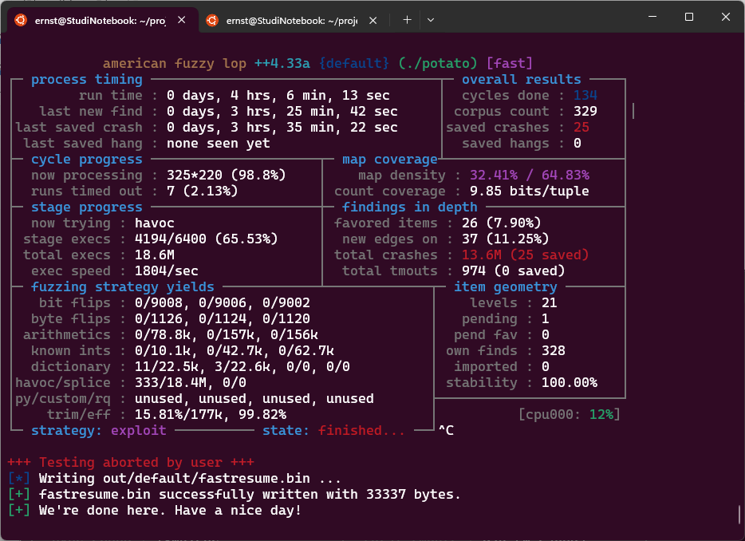
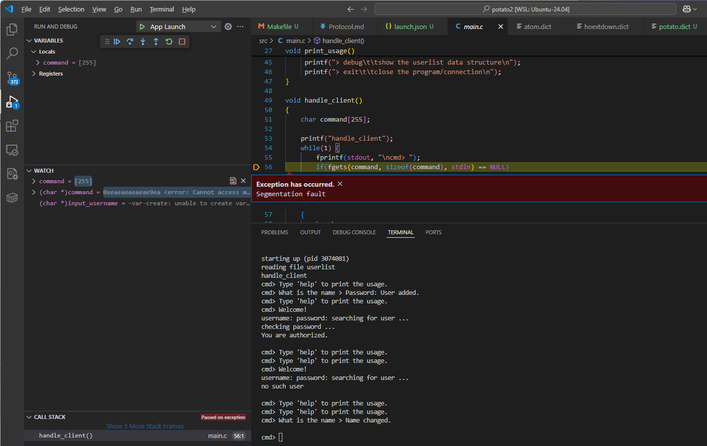

Student: Ernst Schwaiger
Date 2024-06-10

# Fuzzing

The steps below were executed on a Ubuntu 24.04 VM on WSL2

## Install dependencies, build Afl++

Install dependenciesl like outlined [here](https://github.com/AFLplusplus/AFLplusplus/blob/stable/docs/INSTALL.md), the dependencies for Nyx and Qemu mode
were left out as they are not needed for this specific lab. The clang version below is "18", but that number can differ, depending on the used Linux distribution.

```bash
sudo apt-get update
sudo apt-get install -y build-essential python3-dev automake cmake git flex bison libglib2.0-dev libpixman-1-dev python3-setuptools cargo libgtk-3-dev
# try to install llvm 18 and install the distro default if that fails
sudo apt-get install -y lld-18 llvm-18 llvm-18-dev clang-18 || sudo apt-get install -y lld llvm llvm-dev clang
sudo apt-get install -y gcc-$(gcc --version|head -n1|sed 's/\..*//'|sed 's/.* //')-plugin-dev libstdc++-$(gcc --version|head -n1|sed 's/\..*//'|sed 's/.* //')-dev
git clone https://github.com/AFLplusplus/AFLplusplus
cd AFLplusplus
make all
```

In order to make the usage of Afl++ easier, extend the `PATH` variable: `export PATH=<Afl++Path>:$PATH`, where
`<Afl++Path>` is the path to the folder where `Afl++` has been checked out.

## Build potato binary

To get the `potato` app to link, several `openssl` libraries are required. One way
to obtain them is to checkout and build `openssl`:

```bash
git clone https://github.com/openssl/openssl.git
cd openssl
./Configure
make -sj
```

In the last step, checkout the potato sources

```bash
git clone https://github.com/edgecase1/potato2.git
```

## Run Afl++ to find crashes in `potato`

In the `potato2` folder, create a Makefile for building potato and for fuzzing it using `Afl++`.
Instead of `gcc` or `clang` it is using one of the `Afl++` compilers, e.g. `afl-clang-lto`. These
compilers are generating machine code, and, in addition to that, inject instrumentation code
to detect crashes and convey execution path info to `Afl++`.
An additional `fuzz` target is added, which runs the fuzzer. `afl-fuzz` takes an auto-generated
input seed from `seeds` and stores its temporary and output files in the `out` folder.
`-p` selects one of the fuzzing policies and `-x` specifies an input dictionary file which is
passed to help the fuzzing process find interesting input:

```Makefile
# needs to have openssl checked out as sibling folder of potato 
# git clone https://github.com/openssl/openssl.git
# for the Makefile to work the Afl++ folder must have been added
# to the PATH environment variable. 
 
WARN_OPTS=-Wno-deprecated-declarations -Wno-unused-result 
SEC_OPTS=-fno-stack-protector -z execstack -no-pie 
DEBUG_OPTS=-ggdb3 -O0 
INCLUDES=-I../openssl/include -I/usr/include -I/usr/include/x86_64-linux-gnu -Isrc 
DEFINES=-D_FORTIFY_SOURCE=0 
CC=afl-clang-lto
CCOPTS = $(WARN_OPTS) $(SEC_OPTS) $(DEBUG_OPTS) $(INCLUDES) $(DEFINES) 
 
CFILES = \
 src/main.c \
 src/runr.c \
 src/sock.c \
 src/userlist.c \
 src/func.c \
 src/login2.c 
 
HFILES = \
 src/runr.h \
 src/sock.h \
 src/user.h \
 src/userlist.h 
 
.PHONY: clean all 
 
all: potato
 
# binary for usual attacks 
potato: $(CFILES) $(HFILES) 
	$(CC) $(CCOPTS) -o potato $(CFILES) -L../openssl -lssl -lcrypto 

fuzz: seeds/seed out
	afl-fuzz -i ./seeds -o out -p fast -x ./potato.dict -- ./potato console

seeds/seed:
	mkdir -p seeds
	echo "login" >seeds/seed

out:
	mkdir -p out
 
clean: 
	rm -f potato
```

On the test system, the `mmap()` call in `runr_start()` always returns `NULL` causing the process to terminate whenever the `shell` command
is executed. In order to avoid this, that command was removed from `handle_client()`:

```c
/* ... */
else if(strncmp(command, "logout", 6) == 0)
{
    if(! is_authenticated()) continue;
    logout();
}
// else if(strncmp(command, "shell", 5) == 0)
// {
//     if(! is_authenticated()) continue;
//     shell();
// }
else if(strncmp(command, "changepw", 8) == 0)
{
    if(! is_authenticated()) continue;
    change_password();
}
/* ... */
```

Now, potato2 can be built by running `make`, `afl-clang-lto` already extracts some strings from 
strncmp() calls it found in the source code and puts them into a dictionary:

```bash
make
...
afl-llvm-lto++4.33a by Marc "vanHauser" Heuse <mh@mh-sec.de>
strncmp: length 4/4 "list"
strncmp: length 8/8 "register"
strncmp: length 6/6 "delete"
strncmp: length 4/4 "read"
strncmp: length 5/5 "write"
strncmp: length 5/5 "purge"
strncmp: length 5/5 "debug"
strncmp: length 5/5 "login"
strncmp: length 6/6 "logout"
strncmp: length 5/5 "shell"
strncmp: length 8/8 "changepw"
strncmp: length 10/10 "changename"
strncmp: length 6/6 "whoami"
strncmp: length 4/4 "exit"
strncmp: length 4/4 "help"
strncmp: length 6/6 "server"
strncmp: length 7/7 "console"
```
That output is copied into `potato.dict`, adapted and extended. The last two entries
shall help `Afl++` to successfully log in (the strings don't show up in the source
code, so `Afl++` has no way of finding them by itself). The `potato.dict` file is passed
via the `-x` parameter in the Makefile `fuzz` rule:

```bash
list_cmd="list"
register_cmd="register"
delete_cmd="delete"
read_cmd="read"
write_cmd="write"
purge_cmd="purge"
debug_cmd="debug"
login_cmd="login"
logout_cmd="logout"
shell_cmd="shell"
changepw_cmd="changepw"
changename_cmd="changename"
whoami_cmd="whoami"
exit_cmd="exit"
help_cmd="help"
server_option="server"
console_option="console"
username="peter"
password="12345"
```

`make fuzz` will run the fuzz tests on potato2. On some systems, `Afl++` complains:

```bash
[-] Your system is configured to send core dump notifications to an
    external utility. This will cause issues: there will be an extended delay
    between stumbling upon a crash and having this information relayed to the
    fuzzer via the standard waitpid() API.
    If you're just experimenting, set 'AFL_I_DONT_CARE_ABOUT_MISSING_CRASHES=1'.

    To avoid having crashes misinterpreted as timeouts, please 
    temporarily modify /proc/sys/kernel/core_pattern, like so:

    echo core | sudo tee /proc/sys/kernel/core_pattern
```

In that case, run `echo core | sudo tee /proc/sys/kernel/core_pattern`, then run `make fuzz` again,
which should now show the status page on the terminal. After a few minutes, `Afl++` has roughly found 150 distinct tests in the CORPUS, but no crashes yet:

```bash
            american fuzzy lop ++4.33a {default} (./potato) [fast]
┌─ process timing ────────────────────────────────────┬─ overall results ────┐
│        run time : 0 days, 0 hrs, 6 min, 10 sec      │  cycles done : 28    │
│   last new find : 0 days, 0 hrs, 0 min, 22 sec      │ corpus count : 154   ││
│last saved crash : none seen yet                     │saved crashes : 0     │
│ last saved hang : none seen yet                     │  saved hangs : 0     │
├─ cycle progress ─────────────────────┬─ map coverage┴──────────────────────┤
│  now processing : 13.181 (8.4%)      │    map density : 13.79% / 52.41%    │
│  runs timed out : 0 (0.00%)          │ count coverage : 8.39 bits/tuple    │
├─ stage progress ─────────────────────┼─ findings in depth ─────────────────┤
│  now trying : havoc                  │ favored items : 24 (15.58%)         │
│ stage execs : 46/86 (53.49%)         │  new edges on : 29 (18.83%)         │
│ total execs : 788k                   │ total crashes : 0 (0 saved)         │
│  exec speed : 2332/sec               │  total tmouts : 0 (0 saved)         │
├─ fuzzing strategy yields ────────────┴─────────────┬─ item geometry ───────┤
│   bit flips : 0/608, 0/606, 0/602                  │    levels : 13        │
│  byte flips : 0/76, 0/74, 0/70                     │   pending : 0         │
│ arithmetics : 0/5292, 0/10.1k, 0/9520              │  pend fav : 0         │
│  known ints : 0/676, 0/2792, 0/3900                │ own finds : 153       │
│  dictionary : 11/1288, 3/1326, 0/0, 0/0            │  imported : 0         │
│havoc/splice : 136/780k, 0/0                        │ stability : 100.00%   │
│py/custom/rq : unused, unused, unused, unused       ├───────────────────────┘
│    trim/eff : 23.44%/5706, 97.37%                  │          [cpu000: 12%]
└─ strategy: explore ────────── state: in progress ──┘
```

Letting `Afl++` run for a little longer will yield crashes after a 15 to 20 minutes.
Running it even longer will yield more than 20 crashes, like shown below. The fuzzing
process can be stopped by pressing `Ctrl-C`:



## Identify two inputs triggering a crash or undefined behavior

`Afl++` saves the crash files in `out/default/crashes`. Any of these files, if used as input
to `potato console`, will cause it to crash. The first file has id `000000`:

```bash
./potato console < out/default/crashes/id\:000000\,sig\:11\,src\:000075\,time\:600548\,execs\:1405267\,op\:havoc\,rep\:14
starting up (pid 3055424)
reading file userlist
handle_client
cmd> Type 'help' to print the usage.
cmd> What is the name > Password: Segmentation fault
```

Looking at the content of the file:
```bash
hexdump -C out/default/crashes/id\:000000\,sig\:11\,src\:000075\,time\:600548\,execs\:1405267\,op\:havoc\,rep\:14
00000000  6c 6f 65 67 8b 8b 0a 72  65 67 69 73 74 65 72 65  |loeg...registere|
00000010  61 64 6e 1a 0a 0a 0a 1a  0a 6c 6f 67 69 6e 1a 0a  |adn......login..|
00000020  0a 0a 0a 8b 0a 6c 6f 67  69 6e 1a 65 65 0a 6c 6f  |.....login.ee.lo|
00000030  67 69 6e 1a 0a 0a 0a 0a  63 68 61 6e 67 65 6e 61  |gin.....changena|
00000040  6d 65 6e 1a 0a 65 65 65  ea ea ea ea ea ea ea ea  |men..eee........|
00000050  ea ea ea ea ea ea ea ea  ea ea ea ea ea ea ea ea  |................|
00000060  ea eb ea ea ea ea ea ea  ea ea ea ea ea ea ea ea  |................|
00000070  ea ea ea ea ea ea ea ea  ea ea ea ea ea ea ea ea  |................|
00000080  c9 ea ea ea ea ea ea ea  ea ea ea ea ea ea ea ea  |................|
00000090  80 ea ea ea ea ea ea ea  ea ea ea ea 0a 6c 7f 67  |.............l.g|
000000a0  69 6e 1a 0a 0a 0a 1a 0a  6c 6f 67 69 6e 1a 0a 0b  |in......login...|
000000b0  0a 0a e4 0a 6c 6f 67 69  6e 1a 0a a0 d5 0a 0a 0a  |....login.......|
000000c0  6e 00 0a 72 f4 74 68 65  00 0a 73 68 65 6c 6c 19  |n..r.the..shell.|
000000d0  0a 73 68 65 0a 0a 0a 0a  2c 0a 0a 0a 0a           |.she....,....|
000000dd
```

Running `potato` in a debugger using the file as input reveals that the issue is caused
by an empty `userlist` file. One or more test cases in `Afl++` caused the file to be
emptied, which in turn causes a crash whenever a user tries to register. The userlist
head is `NULL` and a segfault is thrown when `potato` tries to reference it.

Restoring the `userlist` from git, then re-running the test in the debugger, reveals that
the input still causes a segfault, albeit at a different place:



The console output indicates the last executed command was "changename", overflowing the
`input_username` buffer so that the saved pointer to the calling functions stack frame got
overwritten, but not the return address itself. Therefore `change_name()` successfully
returns to the caller, `handle_client()`, but this function has its stack frame address
overwritten to an invalid address, causing a crash when accessing the local variable
`command[]`.

Examining the second file: `out/default/crashes/id:000002,sig:11,src:000145,time:601783,execs:1407855,op:havoc,rep:14`

```bash
hexdump -C `out/default/crashes/id:000002,sig:11,src:000145,time:601783,execs:1407855,op:havoc,rep:14`
00000000  6c 6f 67 8b 8b 0a 72 65  67 69 73 74 65 72 6c 6f  |log...registerlo|
00000010  0a 0a 0a 63 80 65 0a 6c  6f 67 69 6e e5 0a 0a 0a  |...c.e.login....|
00000020  70 0a 64 65 62 75 67 0a  5d 70 0a 64 65 62 75 67  |p.debug.]p.debug|
00000030  6b 0a 82 65 6c 65 74 65  0a 2c 0a ff ff ff 80 64  |k..elete.,.....d|
00000040  65 6c 65 74 65 54 6b 0a  64 65 6c 65 74 43 62 75  |eleteTk.deletCbu|
00000050  6e ff 64 65 6c 65 74 65  3d 6b 0a 64 65 6c 65 74  |n.delete=k.delet|
00000060  65 0a 2c 0a 2c 0a 64 0a  64 52 52 52 52 52 52 52  |e.,.,.d.dRRRRRRR|
00000070  52 52 52 52 52 52 52 52  52 52 52 52 52 52 52 52  |RRRRRRRRRRRRRRRR|
*
00001f70  52 52 52 52 52 52 52 3e  52 52 52 52 52 52 52 52  |RRRRRRR>RRRRRRRR|
00001f80  52 52 52 52 52 52 52 52  52 52 52 52 52 52 52 52  |RRRRRRRRRRRRRRRR|
*
00002020  52 52 52 52 52 52 52 52  52 52 52 74 65 6e 52 52  |RRRRRRRRRRRtenRR|
00002030  52 52 52 52 52 52 52 52  52 52 52 52 52 52 52 52  |RRRRRRRRRRRRRRRR|
*
00002d20  52 52 52 52 52 52 52 52  ff ff 52 52 52 52 52 52  |RRRRRRRR..RRRRRR|
00002d30  52 52 52 52 52 52 52 52  52 52 52 52 52 52 52 52  |RRRRRRRRRRRRRRRR|
*
00003630  52 52 52 52 52 52 52 0a  72 65 61 64 0a 72 65 61  |RRRRRRR.read.rea|
00003640  64 f2 69 1f 0a 63 68 61  6e 67 65 70 77 0a 0a 1f  |d.i..changepw...|
00003650  0a 63 68 61 6e 67 65 70  77 73 6f 67 6c 0a 70 0a  |.changepwsogl.p.|
00003660  64 65 62 75 67 0a 6c 70  0a 64 65 62 75 67 0a 0a  |debug.lp.debug..|
00003670  0a 1f 0a 63 68 61 6e 67  65 70 77 0a 0a 1f 0a 63  |...changepw....c|
00003680  68 61 6e 67 65 70 77 73  6f 0a 6c 6f 0a 0a 0a 0a  |hangepwso.lo....|
00003690  0a 63 68 61 6e 67 65 6e  61 6d 65 6c 52 52 52 52  |.changenamelRRRR|
000036a0  52 52 52 52 52 52 52 52  52 52 52 52 52 52 52 52  |RRRRRRRRRRRRRRRR|
*
00004380  52 52 52 52 52 52 62 52  52 52 52 52 52 52 52 52  |RRRRRRbRRRRRRRRR|
00004390  52 52 52 52 52 52 52 52  52 52 52 52 52 52 52 52  |RRRRRRRRRRRRRRRR|
*
000050a0  52 52 52 52 52 52 52 52  52 52 52 52 2f 52 52 52  |RRRRRRRRRRRR/RRR|
000050b0  52 52 52 52 52 52 52 52  52 52 52 52 52 52 52 52  |RRRRRRRRRRRRRRRR|
*
00006140  52 52 52 52 52 52 65 6c  65 74 65 54 6b 0a 64 65  |RRRRRReleteTk.de|
00006150  6c 65 91 65 0a 2c 0a 0a  0a 64 65 6c 65 74 65 0a  |le.e.,...delete.|
00006160  0a                                                |.|
00006161
```

which crashes the app directly in `change_name()` by passing a string in 3k
length which overflows the stack completely.


## Prepare a command line or script + file to run the input against the vulnerable program

Rename both crash files for easier handling:

[input1.txt](./input1.txt)  
[input2.txt](./input2.txt)

Bash script to run one of these two files:

```bash
#!/bin/bash

function usage
{
    echo "usage: $1 [1|2]"
    echo "crashes potato using crashfile 1 or 2."
    exit 1
}

if [ "$#" -ne 1 ]; then
    usage $0
else
    if [ "$1" == "0" ]; then
        crashFile="./input1.txt"
    else
        crashFile="./input2.txt"
    fi
    echo "crashing potato in 3..2..1.."
    echo "./potato console < ${crashFile}"
    ./potato console < ${crashFile}
fi
```

## use sanitizers or assertions to identify another vulnerabiltiy

FIXME: Maybe empty the users list, run the register function?

## Use Libfuzzer to fuzz a vulnerable function

For building a libFuzzer binary, the Makefile gets extended. `CLANGOPTS` gets additional compiler
options, `-fsanitize=fuzzer,address` instructs the clang to link the `libfuzzer` library and to
enable the `Address Sanitizer`. `-DLIBFUZZER` is used to replace the main() function by the
`LLVMFuzzerTestOneInput()` function which LibFuzzer is expecting:

```Makefile
# needs to have openssl checked out as sibling folder of potato 
# git clone https://github.com/openssl/openssl.git
# for the Makefile to work the Afl++ folder must have been added
# to the PATH environment variable. 
 
WARN_OPTS=-Wno-deprecated-declarations -Wno-unused-result 
SEC_OPTS=-fno-stack-protector -z execstack -no-pie 
DEBUG_OPTS=-ggdb3 -O0 
INCLUDES=-I../openssl/include -I/usr/include -I/usr/include/x86_64-linux-gnu -Isrc 
DEFINES=-D_FORTIFY_SOURCE=0 
CC=afl-clang-lto
CCOPTS = $(WARN_OPTS) $(SEC_OPTS) $(DEBUG_OPTS) $(INCLUDES) $(DEFINES)

CLANGOPTS = $(WARN_OPTS) $(DEBUG_OPTS) $(INCLUDES) $(DEFINES) -DLIBFUZZER -fsanitize=fuzzer,address

CFILES = \
 src/main.c \
 src/runr.c \
 src/sock.c \
 src/userlist.c \
 src/func.c \
 src/login2.c 
 
HFILES = \
 src/runr.h \
 src/sock.h \
 src/user.h \
 src/userlist.h 
 
.PHONY: clean all 
 
all: potato fuzz_potato
 
# binary for usual attacks 
potato: $(CFILES) $(HFILES) 
	$(CC) $(CCOPTS) -o potato $(CFILES) -L../openssl -lssl -lcrypto 

fuzz: seeds/seed out
	afl-fuzz -i ./seeds -o out -p fast -- ./potato console

seeds/seed:
	mkdir -p seeds
	echo "login" >seeds/seed

out:
	mkdir -p out

fuzz_potato:
	clang  $(CLANGOPTS) -o fuzz_potato $(CFILES) -L../openssl -lssl -lcrypto 

clean: 
	rm -f potato fuzz_potato
```

In the second step, `main.c` needs to be patched to enable fuzzing:

```c
#ifndef LIBFUZZER
int
main(int argc, char** argv)
{
    /* ... */
}
#else
#include <stdint.h>

static void doFuzz()
{
    init();
    // for now, fuzz with an empty list
    //read_list("userlist");
    handle_client();
    // do a manual cleanup
    purge_list();    
}

int LLVMFuzzerTestOneInput(const uint8_t *Data, size_t Size) 
{
    // use fmemopen() to redirect stdin to the buffer libfuzzer is providing
    FILE *fp = fmemopen((void*)Data, Size, "r");
    if (fp != NULL) 
    {
        stdin = fp;  // Redirect stdin
        doFuzz();  // Call the function that reads from stdin
        fclose(fp);
    }
    else
    {
        assert(0);        
    }

    return 0;  // Values other than 0 and -1 are reserved for future use.
}
#endif
```

LibFuzzer expects an implementation of `int LLVMFuzzerTestOneInput(const uint8_t *Data, size_t Size)`,
where it passes the fuzz data via `Data` and `Size`. The function is expected to return `0` in all cases.
The implementation above uses `fmemopen()` to create a memory file handle, and replaces `stdin` by it.
`doFuzz()` does the actual fuzzing by running `handle_client()` (and `purge_list()` to avoid leaking
memory). `make` now additionally builds `fuzz_potato`, which can be called directly.

LibFuzzer stops immediately if it detects an error. That error needs to be fixed and the fuzzer re-run
until no additional crashes are detected for a longer period of time. The first problem LibFuzzer detected
on the test system  are the leaking calls to `str2md5()`. They are fixed by patching the respective functions:

```c
void
change_password()
{
    //char* input_password;
    //input_password = getpass("Password: "); fflush(stdout);

    char input_password[PASSWORD_LENGTH];
    fprintf(stdout, "Password: ");
    fgets(input_password, sizeof(input_password), stdin);
    input_password[strcspn(input_password, "\n")] = 0x00; // terminator instead of a newline

    // Commented out leaking code
    // strncpy(session.logged_in_user->password_hash, 
    //         str2md5(input_password, strlen(input_password)), 
	//     32);

    // Mem-leak free variant
    char *md5 = str2md5(input_password, strlen(input_password));
    strncpy(session.logged_in_user->password_hash, md5, 32);
    free(md5);
    
    fprintf(stdout, "Password changed.\n");
}
```

```c
int
check_password(t_user* user, char* password)
{
    // Commented out leaking code    
    // return (0 == strncmp(
    //                     user->password_hash, 
	// 	        str2md5(password, strlen(password)), 
	// 		32)); // md5 length

    // Non-leaking variant
    char *md5 = str2md5(password, strlen(password));
    int ret = strncmp(user->password_hash, md5, 32);
    free(md5);
    return ret;
}
```

The fuzzer also starts with an empty user list, another bug in `next_free_id()` reveals a missing `NULL` pointer check which is added here:

```c
int
next_free_id() // returns a free id. does not account for gaps
{
     t_user_list_element* element;
     int max_id = 10000; // default first id

     // bug fix: Handle empty list
     if (user_list.head == NULL)
     {
          return max_id;
     }

     element = user_list.head; // start iterating through the list
     while (element->next != NULL) 
     {
          if(max_id <= element->user->id)
          {
               max_id = element->user->id + 1;
          }
          element = element->next;
     }
     return max_id;
}
```

After these patches, `fuzz_potato` runs for a few seconds, then ASAN detects a stack buffer overflow and stops the process:

```bash
=================================================================
==16514==ERROR: AddressSanitizer: stack-buffer-overflow on address 0x7efc66e29c52 at pc 0x562ae81d58e9 bp 0x7ffce1ab38e0 sp 0x7ffce1ab3070
WRITE of size 59 at 0x7efc66e29c52 thread T0
    #0 0x562ae81d58e8 in scanf_common(void*, int, bool, char const*, __va_list_tag*) asan_interceptors.cpp.o
    #1 0x562ae81d69a9 in __isoc23_fscanf (/home/ernst/projects/CyberSecurity/potato2/fuzz_potato+0x8d9a9) (BuildId: a204a87f0e70f82a0d057b0b5fb021573dae5cd9)
    #2 0x562ae8290442 in change_name /home/ernst/projects/CyberSecurity/potato2/src/func.c:187:5
    #3 0x562ae828bdc9 in handle_client /home/ernst/projects/CyberSecurity/potato2/src/main.c:124:13
    #4 0x562ae828c1e9 in doFuzz /home/ernst/projects/CyberSecurity/potato2/src/main.c:212:5
    #5 0x562ae828c119 in LLVMFuzzerTestOneInput /home/ernst/projects/CyberSecurity/potato2/src/main.c:245:9
    #6 0x562ae8198e04 in fuzzer::Fuzzer::ExecuteCallback(unsigned char const*, unsigned long) (/home/ernst/projects/CyberSecurity/potato2/fuzz_potato+0x4fe04) (BuildId: a204a87f0e70f82a0d057b0b5fb021573dae5cd9)
    #7 0x562ae81984f9 in fuzzer::Fuzzer::RunOne(unsigned char const*, unsigned long, bool, fuzzer::InputInfo*, bool, bool*) (/home/ernst/projects/CyberSecurity/potato2/fuzz_potato+0x4f4f9) (BuildId: a204a87f0e70f82a0d057b0b5fb021573dae5cd9)
    #8 0x562ae8199ce5 in fuzzer::Fuzzer::MutateAndTestOne() (/home/ernst/projects/CyberSecurity/potato2/fuzz_potato+0x50ce5) (BuildId: a204a87f0e70f82a0d057b0b5fb021573dae5cd9)
    #9 0x562ae819a845 in fuzzer::Fuzzer::Loop(std::vector<fuzzer::SizedFile, std::allocator<fuzzer::SizedFile>>&) (/home/ernst/projects/CyberSecurity/potato2/fuzz_potato+0x51845) (BuildId: a204a87f0e70f82a0d057b0b5fb021573dae5cd9)
    #10 0x562ae8187b1f in fuzzer::FuzzerDriver(int*, char***, int (*)(unsigned char const*, unsigned long)) (/home/ernst/projects/CyberSecurity/potato2/fuzz_potato+0x3eb1f) (BuildId: a204a87f0e70f82a0d057b0b5fb021573dae5cd9)
    #11 0x562ae81b21a6 in main (/home/ernst/projects/CyberSecurity/potato2/fuzz_potato+0x691a6) (BuildId: a204a87f0e70f82a0d057b0b5fb021573dae5cd9)
    #12 0x7efc68b791c9 in __libc_start_call_main csu/../sysdeps/nptl/libc_start_call_main.h:58:16
    #13 0x7efc68b7928a in __libc_start_main csu/../csu/libc-start.c:360:3
    #14 0x562ae817cb04 in _start (/home/ernst/projects/CyberSecurity/potato2/fuzz_potato+0x33b04) (BuildId: a204a87f0e70f82a0d057b0b5fb021573dae5cd9)

Address 0x7efc66e29c52 is located in stack of thread T0 at offset 82 in frame
    #0 0x562ae82902bf in change_name /home/ernst/projects/CyberSecurity/potato2/src/func.c:182

  This frame has 1 object(s):
    [32, 82) 'input_username' (line 183) <== Memory access at offset 82 overflows this variable
HINT: this may be a false positive if your program uses some custom stack unwind mechanism, swapcontext or vfork
      (longjmp and C++ exceptions *are* supported)
SUMMARY: AddressSanitizer: stack-buffer-overflow asan_interceptors.cpp.o in scanf_common(void*, int, bool, char const*, __va_list_tag*)
Shadow bytes around the buggy address:
  0x7efc66e29980: f5 f5 f5 f5 f5 f5 f5 f5 f5 f5 f5 f5 f5 f5 f5 f5
  0x7efc66e29a00: f5 f5 f5 f5 f5 f5 f5 f5 f5 f5 f5 f5 f5 f5 f5 f5
  0x7efc66e29a80: f5 f5 f5 f5 f5 f5 f5 f5 f5 f5 f5 f5 f5 f5 f5 f5
  0x7efc66e29b00: f5 f5 f5 f5 f5 f5 f5 f5 f5 f5 f5 f5 f5 f5 f5 f5
  0x7efc66e29b80: f5 f5 f5 f5 f5 f5 f5 f5 f5 f5 f5 f5 f5 f5 f5 f5
=>0x7efc66e29c00: f1 f1 f1 f1 00 00 00 00 00 00[02]f3 f3 f3 f3 f3
  0x7efc66e29c80: 00 00 00 00 00 00 00 00 00 00 00 00 00 00 00 00
  0x7efc66e29d00: 00 00 00 00 00 00 00 00 00 00 00 00 00 00 00 00
  0x7efc66e29d80: 00 00 00 00 00 00 00 00 00 00 00 00 00 00 00 00
  0x7efc66e29e00: 00 00 00 00 00 00 00 00 00 00 00 00 00 00 00 00
  0x7efc66e29e80: 00 00 00 00 00 00 00 00 00 00 00 00 00 00 00 00
Shadow byte legend (one shadow byte represents 8 application bytes):
  Addressable:           00
  Partially addressable: 01 02 03 04 05 06 07 
  Heap left redzone:       fa
  Freed heap region:       fd
  Stack left redzone:      f1
  Stack mid redzone:       f2
  Stack right redzone:     f3
  Stack after return:      f5
  Stack use after scope:   f8
  Global redzone:          f9
  Global init order:       f6
  Poisoned by user:        f7
  Container overflow:      fc
  Array cookie:            ac
  Intra object redzone:    bb
  ASan internal:           fe
  Left alloca redzone:     ca
  Right alloca redzone:    cb
==16514==ABORTING
MS: 2 ChangeByte-InsertRepeatedBytes-; base unit: 60f7def47317412f91f9b150921b672159d6fa33
0x30,0xa,0x70,0x6f,0x67,0x6f,0x75,0x74,0xa,0x6f,0x67,0x0,0x0,0x10,0x0,0xa,0x39,0x74,0x6c,0x0,0x72,0xa,0x6c,0x69,0x6f,0x67,0x6e,0x73,0x74,0xa,0xa,0xa,0x65,0x65,0x67,0x67,0xa,0x72,0x65,0x67,0x69,0x73,0x74,0x65,0x72,0xa,0xa,0x8d,0x74,0xa,0xa,0x8d,0x74,0x10,0xa,0x6c,0x6f,0x67,0x69,0x10,0xa,0x6c,0x6f,0x67,0x69,0x6e,0x73,0x74,0xa,0xa,0xa,0x9b,0xa1,0x67,0x6f,0x75,0xa,0x63,0x68,0x61,0x6e,0x67,0x65,0x6e,0x61,0x6d,0x65,0x74,0x6c,0x6f,0x67,0x6f,0x75,0x75,0x74,0xa,0x8d,0x74,0x10,0xe3,0xe3,0xe3,0xe3,0xe3,0xe3,0xe3,0xe3,0xe3,0xe3,0xe3,0xe3,0xe3,0xe3,0xe3,0xe3,0xe3,0xe3,0xe3,0xe3,0xe3,0xe3,0xe3,0xe3,0xe3,0xe3,0xe3,0xe3,0xe3,0xe3,0xe3,0xe3,0xe3,0xe3,0xe3,0xe3,0xe3,0xe3,0xe3,0xe3,0xe3,0xe3,0xe3,0xe3,0xe3,0xe3,0xe3,0xe3,0xe3,0xe3,0xe3,0xe3,0xe3,0xe3,0xe3,0xa,0x72,0x6c,0x67,0xa,0x72,0x75,0xa,0x63,0x68,0x61,0x6e,0x67,0x65,0x6e,0x61,0x6d,0x65,0x65,
0\012pogout\012og\000\000\020\000\0129tl\000r\012liognst\012\012\012eegg\012register\012\012\215t\012\012\215t\020\012logi\020\012loginst\012\012\012\233\241gou\012changenametlogouut\012\215t\020\343\343\343\343\343\343\343\343\343\343\343\343\343\343\343\343\343\343\343\343\343\343\343\343\343\343\343\343\343\343\343\343\343\343\343\343\343\343\343\343\343\343\343\343\343\343\343\343\343\343\343\343\343\343\343\012rlg\012ru\012changenamee
artifact_prefix='./'; Test unit written to ./crash-8cbb3a75d2d1d43b8270abeb9570046420ca702d
Base64: MApwb2dvdXQKb2cAABAACjl0bAByCmxpb2duc3QKCgplZWdnCnJlZ2lzdGVyCgqNdAoKjXQQCmxvZ2kQCmxvZ2luc3QKCgqboWdvdQpjaGFuZ2VuYW1ldGxvZ291dXQKjXQQ4+Pj4+Pj4+Pj4+Pj4+Pj4+Pj4+Pj4+Pj4+Pj4+Pj4+Pj4+Pj4+Pj4+Pj4+Pj4+Pj4+Pj4+Pj4wpybGcKcnUKY2hhbmdlbmFtZWU=
```

As expected, the overflow happens in `change_name()`, and the stack buffer that got overflown was `input_username`.
LibFuzzer usually creates a crashfile when it detects errors, probably the trick with redirecting `stdin` prevented
it from doing that. The ASAN error message contains a Base64 encoding of the data stream which caused the crash, so this
can be used to create a crashfile by hand:

```bash
echo "MApwb2dvdXQKb2cAABAACjl0bAByCmxpb2duc3QKCgplZWdnCnJlZ2lzdGVyCgqNdAoKjXQQCmxvZ2kQCmxvZ2luc3QKCgqboWdvdQpjaGFuZ2VuYW1ldGxvZ291dXQKjXQQ4+Pj4+Pj4+Pj4+Pj4+Pj4+Pj4+Pj4+Pj4+Pj4+Pj4+Pj4+Pj4+Pj4+Pj4+Pj4+Pj4+Pj4+Pj4wpybGcKcnUKY2hhbmdlbmFtZWU=" | base64 -d > crashfile
hexdump -C crashfile
00000000  30 0a 70 6f 67 6f 75 74  0a 6f 67 00 00 10 00 0a  |0.pogout.og.....|
00000010  39 74 6c 00 72 0a 6c 69  6f 67 6e 73 74 0a 0a 0a  |9tl.r.liognst...|
00000020  65 65 67 67 0a 72 65 67  69 73 74 65 72 0a 0a 8d  |eegg.register...|
00000030  74 0a 0a 8d 74 10 0a 6c  6f 67 69 10 0a 6c 6f 67  |t...t..logi..log|
00000040  69 6e 73 74 0a 0a 0a 9b  a1 67 6f 75 0a 63 68 61  |inst.....gou.cha|
00000050  6e 67 65 6e 61 6d 65 74  6c 6f 67 6f 75 75 74 0a  |ngenametlogouut.|
00000060  8d 74 10 e3 e3 e3 e3 e3  e3 e3 e3 e3 e3 e3 e3 e3  |.t..............|
00000070  e3 e3 e3 e3 e3 e3 e3 e3  e3 e3 e3 e3 e3 e3 e3 e3  |................|
*
00000090  e3 e3 e3 e3 e3 e3 e3 e3  e3 e3 0a 72 6c 67 0a 72  |...........rlg.r|
000000a0  75 0a 63 68 61 6e 67 65  6e 61 6d 65 65           |u.changenamee|
000000ad
```

LibFuzzer binaries accept an input file as first parameter, so the crash can be reproduced by passing the crashfile:

```bash
./fuzz_potato crashfile
Type 'help' to print the usage.cmd> 
cmd> What is the name > Password: User added.
Type 'help' to print the usage.cmd> 
Type 'help' to print the usage.cmd> 
Type 'help' to print the usage.cmd> 
cmd> Welcome!
username: password: searching for user ...
checking password ...
You are authorized.

Type 'help' to print the usage.cmd> 
=================================================================
==25830==ERROR: AddressSanitizer: stack-buffer-overflow on address 0x7f02f0900052 at pc 0x5595978a48e9 bp 0x7ffefecaa9a0 sp 0x7ffefecaa130
WRITE of size 59 at 0x7f02f0900052 thread T0
...
==25830==ABORTING
```

## References

### Input files and script for Afl++ crashes

[input1.txt](./input1.txt)  
[input2.txt](./input2.txt)  
[crashPotato.sh](./crashPotato.sh)  

### Patched Source Files for LibFuzzer and crashfile

[src/func.c](./src/func.c)  
[src/login2.c](./src/login2.c)  
[src/userlist.c](./src/userlist.c)  

[crashfile](./crashfile)  
