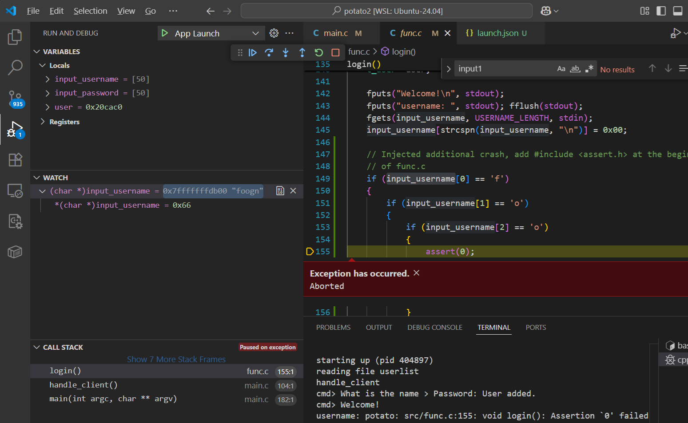

Student: Ernst Schwaiger
Date 2024-06-10

# Fuzzing

The steps below were executed on a Ubuntu 24.04 VM on WSL2

## Install dependencies, build Afl++

Install dependencies like outlined [here](https://github.com/AFLplusplus/AFLplusplus/blob/stable/docs/INSTALL.md), the dependencies for Nyx and Qemu mode
were left out as they are not needed for this specific lab. The clang version below is "18", but that number can differ, depending on the used Linux distribution.

```bash
sudo apt-get update
sudo apt-get install -y build-essential python3-dev automake cmake git flex bison libglib2.0-dev libpixman-1-dev python3-setuptools cargo libgtk-3-dev
# try to install llvm 18 and install the distro default if that fails
sudo apt-get install -y lld-18 llvm-18 llvm-18-dev clang-18 || sudo apt-get install -y lld llvm llvm-dev clang
sudo apt-get install -y gcc-$(gcc --version|head -n1|sed 's/\..*//'|sed 's/.* //')-plugin-dev libstdc++-$(gcc --version|head -n1|sed 's/\..*//'|sed 's/.* //')-dev
git clone https://github.com/AFLplusplus/AFLplusplus
cd AFLplusplus
make all
```

In order to make the usage of Afl++ easier, extend the `PATH` variable: `export PATH=<Afl++Path>:$PATH`, where
`<Afl++Path>` is the path to the folder where `Afl++` has been checked out.

## Build potato binary

To get the `potato` app to link, several `openssl` libraries are required. One way
to obtain them is to checkout and build `openssl`:

```bash
git clone https://github.com/openssl/openssl.git
cd openssl
./Configure
make -sj
```

In the last step, checkout the potato sources

```bash
git clone https://github.com/edgecase1/potato2.git
```

##  Identify two inputs that trigger a crash or undefined behavior using a fuzzing technique

This section used Afl++ to find crashes in `potato`

In the `potato2` folder, create a Makefile for building potato and for fuzzing it using `Afl++`.
Instead of `gcc` or `clang` it is using one of the `Afl++` compilers, e.g. `afl-clang-lto`. These
compilers are generating machine code, and, in addition to that, inject instrumentation code
to detect crashes and convey execution path info to `Afl++`.
An additional `fuzz` target is added, which runs the fuzzer. `afl-fuzz` takes an auto-generated
input seed from `seeds` and stores its temporary and output files in the `out` folder.
`-p` selects one of the fuzzing policies and `-x` specifies an input dictionary file which is
passed to help the fuzzing process find interesting input:

```Makefile
# needs to have openssl checked out as sibling folder of potato 
# git clone https://github.com/openssl/openssl.git
# for the Makefile to work the Afl++ folder must have been added
# to the PATH environment variable. 
 
WARN_OPTS=-Wno-deprecated-declarations -Wno-unused-result 
SEC_OPTS=-fno-stack-protector -z execstack -no-pie 
DEBUG_OPTS=-ggdb3 -O0 
INCLUDES=-I../openssl/include -I/usr/include -I/usr/include/x86_64-linux-gnu -Isrc 
DEFINES=-D_FORTIFY_SOURCE=0 
CC=afl-clang-lto
CCOPTS = $(WARN_OPTS) $(SEC_OPTS) $(DEBUG_OPTS) $(INCLUDES) $(DEFINES) 
 
CFILES = \
 src/main.c \
 src/runr.c \
 src/sock.c \
 src/userlist.c \
 src/func.c \
 src/login2.c 
 
HFILES = \
 src/runr.h \
 src/sock.h \
 src/user.h \
 src/userlist.h 
 
.PHONY: clean all 
 
all: potato
 
# binary for usual attacks 
potato: $(CFILES) $(HFILES) 
	$(CC) $(CCOPTS) -o potato $(CFILES) -L../openssl -lssl -lcrypto 

fuzz: seeds/seed out
	afl-fuzz -i ./seeds -o out -p fast -x ./potato.dict -- ./potato console

seeds/seed:
	mkdir -p seeds
	echo "login" >seeds/seed

out:
	mkdir -p out
 
clean: 
	rm -f potato
```

### Patch and inject an additional "crash" into `potato`

On the test system, the `mmap()` call in `runr_start()` always returns `NULL` causing the process to terminate whenever the `shell` command
is executed. In order to avoid this, that command was removed from `handle_client()`:

```c
/* ... */
else if(strncmp(command, "logout", 6) == 0)
{
    if(! is_authenticated()) continue;
    logout();
}
// else if(strncmp(command, "shell", 5) == 0)
// {
//     if(! is_authenticated()) continue;
//     shell();
// }
else if(strncmp(command, "changepw", 8) == 0)
{
    if(! is_authenticated()) continue;
    change_password();
}
/* ... */
```

In addition to the buffer overflow that was identified and eploited in the previous sessions,
an additional crashing code is inserted into the `potato` project. This code will terminate
the application if a login is tried with a username starting with the string `foo`:

```c
void
login()
{
    char input_username[USERNAME_LENGTH];
    //char* input_password;
    char input_password[PASSWORD_LENGTH];
    t_user* user;

    fputs("Welcome!\n", stdout);
    fputs("username: ", stdout); fflush(stdout);
    fgets(input_username, USERNAME_LENGTH, stdin);
    input_username[strcspn(input_username, "\n")] = 0x00;

    // Injected additional crash, add #include <assert.h> at the beginning
    // of func.c
    if (input_username[0] == 'f')
    {
        if (input_username[1] == 'o')
        {
            if (input_username[2] == 'o')
            {
                assert(0);
            }
        }

    }
    // End Injected additional crash 
    /* ... */

```

Now, potato2 can be built by running `make`, `afl-clang-lto` already extracts some strings from 
strncmp() calls it found in the source code and puts them into a dictionary:

```bash
make
...
afl-llvm-lto++4.33a by Marc "vanHauser" Heuse <mh@mh-sec.de>
strncmp: length 4/4 "list"
strncmp: length 8/8 "register"
strncmp: length 6/6 "delete"
strncmp: length 4/4 "read"
strncmp: length 5/5 "write"
strncmp: length 5/5 "purge"
strncmp: length 5/5 "debug"
strncmp: length 5/5 "login"
strncmp: length 6/6 "logout"
strncmp: length 5/5 "shell"
strncmp: length 8/8 "changepw"
strncmp: length 10/10 "changename"
strncmp: length 6/6 "whoami"
strncmp: length 4/4 "exit"
strncmp: length 4/4 "help"
strncmp: length 6/6 "server"
strncmp: length 7/7 "console"
```
That output is copied into `potato.dict`, adapted and extended. The last two entries
shall help `Afl++` to successfully log in (the strings don't show up in the source
code, so `Afl++` has no way of finding them by itself). The `potato.dict` file is passed
via the `-x` parameter in the Makefile `fuzz` rule:

```bash
list_cmd="list"
register_cmd="register"
delete_cmd="delete"
read_cmd="read"
write_cmd="write"
purge_cmd="purge"
debug_cmd="debug"
login_cmd="login"
logout_cmd="logout"
shell_cmd="shell"
changepw_cmd="changepw"
changename_cmd="changename"
whoami_cmd="whoami"
exit_cmd="exit"
help_cmd="help"
server_option="server"
console_option="console"
username="peter"
password="12345"
```

`make fuzz` will run the fuzz tests on potato2. On some systems, `Afl++` complains:

```bash
[-] Your system is configured to send core dump notifications to an
    external utility. This will cause issues: there will be an extended delay
    between stumbling upon a crash and having this information relayed to the
    fuzzer via the standard waitpid() API.
    If you're just experimenting, set 'AFL_I_DONT_CARE_ABOUT_MISSING_CRASHES=1'.

    To avoid having crashes misinterpreted as timeouts, please 
    temporarily modify /proc/sys/kernel/core_pattern, like so:

    echo core | sudo tee /proc/sys/kernel/core_pattern
```

In that case, run `echo core | sudo tee /proc/sys/kernel/core_pattern`, then run `make fuzz` again,
which should now show the status page on the terminal. After a few minutes, `Afl++` has roughly found 150 distinct tests in the CORPUS, but no crashes yet:

```bash
            american fuzzy lop ++4.33a {default} (./potato) [fast]
┌─ process timing ────────────────────────────────────┬─ overall results ────┐
│        run time : 0 days, 0 hrs, 6 min, 10 sec      │  cycles done : 28    │
│   last new find : 0 days, 0 hrs, 0 min, 22 sec      │ corpus count : 154   ││
│last saved crash : none seen yet                     │saved crashes : 0     │
│ last saved hang : none seen yet                     │  saved hangs : 0     │
├─ cycle progress ─────────────────────┬─ map coverage┴──────────────────────┤
│  now processing : 13.181 (8.4%)      │    map density : 13.79% / 52.41%    │
│  runs timed out : 0 (0.00%)          │ count coverage : 8.39 bits/tuple    │
├─ stage progress ─────────────────────┼─ findings in depth ─────────────────┤
│  now trying : havoc                  │ favored items : 24 (15.58%)         │
│ stage execs : 46/86 (53.49%)         │  new edges on : 29 (18.83%)         │
│ total execs : 788k                   │ total crashes : 0 (0 saved)         │
│  exec speed : 2332/sec               │  total tmouts : 0 (0 saved)         │
├─ fuzzing strategy yields ────────────┴─────────────┬─ item geometry ───────┤
│   bit flips : 0/608, 0/606, 0/602                  │    levels : 13        │
│  byte flips : 0/76, 0/74, 0/70                     │   pending : 0         │
│ arithmetics : 0/5292, 0/10.1k, 0/9520              │  pend fav : 0         │
│  known ints : 0/676, 0/2792, 0/3900                │ own finds : 153       │
│  dictionary : 11/1288, 3/1326, 0/0, 0/0            │  imported : 0         │
│havoc/splice : 136/780k, 0/0                        │ stability : 100.00%   │
│py/custom/rq : unused, unused, unused, unused       ├───────────────────────┘
│    trim/eff : 23.44%/5706, 97.37%                  │          [cpu000: 12%]
└─ strategy: explore ────────── state: in progress ──┘
```

Letting `Afl++` run for a little longer will yield crashes after a 15 to 20 minutes.
Running it even longer will yield more than 20 crashes, like shown below. The fuzzing
process can be stopped by pressing `Ctrl-C`:


## Identify two inputs triggering a crash or undefined behavior

`Afl++` saves the crash files in `out/default/crashes`. Any of these files, if used as input
to `potato console`, will cause it to crash. The first file has id `000000`:

```bash
./potato console < out/default/crashes/id\:000000\,sig\:11\,src\:000075\,time\:600548\,execs\:1405267\,op\:havoc\,rep\:14
starting up (pid 3055424)
reading file userlist
handle_client
cmd> Type 'help' to print the usage.
cmd> What is the name > Password: Segmentation fault
```

Looking at the content of the file:
```bash
hexdump -C out/default/crashes/id\:000000\,sig\:11\,src\:000075\,time\:600548\,execs\:1405267\,op\:havoc\,rep\:14
00000000  6c 6f 65 67 8b 8b 0a 72  65 67 69 73 74 65 72 65  |loeg...registere|
00000010  61 64 6e 1a 0a 0a 0a 1a  0a 6c 6f 67 69 6e 1a 0a  |adn......login..|
00000020  0a 0a 0a 8b 0a 6c 6f 67  69 6e 1a 65 65 0a 6c 6f  |.....login.ee.lo|
00000030  67 69 6e 1a 0a 0a 0a 0a  63 68 61 6e 67 65 6e 61  |gin.....changena|
00000040  6d 65 6e 1a 0a 65 65 65  ea ea ea ea ea ea ea ea  |men..eee........|
00000050  ea ea ea ea ea ea ea ea  ea ea ea ea ea ea ea ea  |................|
00000060  ea eb ea ea ea ea ea ea  ea ea ea ea ea ea ea ea  |................|
00000070  ea ea ea ea ea ea ea ea  ea ea ea ea ea ea ea ea  |................|
00000080  c9 ea ea ea ea ea ea ea  ea ea ea ea ea ea ea ea  |................|
00000090  80 ea ea ea ea ea ea ea  ea ea ea ea 0a 6c 7f 67  |.............l.g|
000000a0  69 6e 1a 0a 0a 0a 1a 0a  6c 6f 67 69 6e 1a 0a 0b  |in......login...|
000000b0  0a 0a e4 0a 6c 6f 67 69  6e 1a 0a a0 d5 0a 0a 0a  |....login.......|
000000c0  6e 00 0a 72 f4 74 68 65  00 0a 73 68 65 6c 6c 19  |n..r.the..shell.|
000000d0  0a 73 68 65 0a 0a 0a 0a  2c 0a 0a 0a 0a           |.she....,....|
000000dd
```

Running the test in the debugger reveals that causes a segfault:


The console output indicates the last executed command was "changename", overflowing the
`input_username` buffer so that the saved pointer to the calling functions stack frame got
overwritten, but not the return address itself. Therefore `change_name()` successfully
returns to the caller, `handle_client()`, but this function has its stack frame address
overwritten to an invalid address, causing a crash when accessing the local variable
`command[]`.

The second file  `out/default/crashes/id:000002,sig:11,src:000145,time:601783,execs:1407855,op:havoc,rep:14` triggers the inserted `assert(0)`:

```bash
./potato console < out/default/crashes/id\:000009\,sig\:06\,src\:000100\,time\:306636\,execs\:730933\,op\:havoc\,rep\:3
starting up (pid 403318)
reading file userlist
handle_client
cmd> What is the name > Password: User added.
cmd> Welcome!
username: potato: src/func.c:155: void login(): Assertion `0' failed.
```

Examining its content:

```bash
hexdump -C out/default/crashes/id\:000009\,sig\:06\,src\:000100\,time\:306636\,execs\:730933\,op\:havoc\,rep\:3
00000000  72 65 67 69 73 74 65 72  0a f5 0a 0a 6c 6f 67 69  |register....logi|
00000010  6e 72 64 63 0a 66 6f 6f  67 6e 0a 64 65 6c 65 74  |nrdc.foogn.delet|
00000020  65 0a 0a 6e 0a 64 65 6c  65 74 65 6f 0a 6c 69 73  |e..n.deleteo.lis|
00000030  0a 72 6e 0a 0a 0a 0a 6c  6f 67 69 6e 0a 0a 0a 00  |.rn....login....|
00000040  09 0a 0a 0a 0a 6c 69 73  74 09 0a 0a 0a           |.....list....|
0000004d
```

The "foogn" user name can be found after the "loginrdc" command (the "...rdc" suffix is ignored by the potato input
handler). The program execution reaches the `assert()` statement and terminates the process:



## Prepare a command line or script + file to run the input against the vulnerable program

Rename both crash files for easier handling:

[input1.txt](./input1.txt)  
[input2.txt](./input2.txt)

Bash script to run one of these two files:

```bash
#!/bin/bash

function usage
{
    echo "usage: $1 [1|2]"
    echo "crashes potato using crashfile 1 or 2."
    exit 1
}

if [ "$#" -ne 1 ]; then
    usage $0
else
    if [ "$1" == "0" ]; then
        crashFile="./input1.txt"
    else
        crashFile="./input2.txt"
    fi
    echo "crashing potato in 3..2..1.."
    echo "./potato console < ${crashFile}"
    ./potato console < ${crashFile}
fi
```

## Use sanitizers or assertions to identify another vulnerabiltiy

Done in conjunction with LibFuzzer in the next section

## Use Libfuzzer to fuzz a vulnerable function

For building a libFuzzer binary, the Makefile gets extended. `CLANGOPTS` gets additional compiler
options, `-fsanitize=fuzzer,address` instructs the clang to link the `libfuzzer` library and to
enable the `Address Sanitizer`. `-DLIBFUZZER` is used to replace the main() function by the
`LLVMFuzzerTestOneInput()` function which LibFuzzer is expecting:

```Makefile
# needs to have openssl checked out as sibling folder of potato 
# git clone https://github.com/openssl/openssl.git
# for the Makefile to work the Afl++ folder must have been added
# to the PATH environment variable. 
 
WARN_OPTS=-Wno-deprecated-declarations -Wno-unused-result 
SEC_OPTS=-fno-stack-protector -z execstack -no-pie 
DEBUG_OPTS=-ggdb3 -O0 
INCLUDES=-I../openssl/include -I/usr/include -I/usr/include/x86_64-linux-gnu -Isrc 
DEFINES=-D_FORTIFY_SOURCE=0 
CC=afl-clang-lto
CCOPTS = $(WARN_OPTS) $(SEC_OPTS) $(DEBUG_OPTS) $(INCLUDES) $(DEFINES)

CLANGOPTS = $(WARN_OPTS) $(DEBUG_OPTS) $(INCLUDES) $(DEFINES) -DLIBFUZZER -fsanitize=fuzzer,address

CFILES = \
 src/main.c \
 src/runr.c \
 src/sock.c \
 src/userlist.c \
 src/func.c \
 src/login2.c 
 
HFILES = \
 src/runr.h \
 src/sock.h \
 src/user.h \
 src/userlist.h 
 
.PHONY: clean all 
 
all: potato fuzz_potato
 
# binary for usual attacks 
potato: $(CFILES) $(HFILES) 
	$(CC) $(CCOPTS) -o potato $(CFILES) -L../openssl -lssl -lcrypto 

fuzz: seeds/seed out
	afl-fuzz -i ./seeds -o out -p fast -- ./potato console

seeds/seed:
	mkdir -p seeds
	echo "login" >seeds/seed

out:
	mkdir -p out

fuzz_potato:
	clang  $(CLANGOPTS) -o fuzz_potato $(CFILES) -L../openssl -lssl -lcrypto 

clean: 
	rm -f potato fuzz_potato
```

In the second step, `main.c` needs a patch to work with LibFuzzer:

```c
#ifndef LIBFUZZER
int
main(int argc, char** argv)
{
    /* ... */
}
#else
#include <stdint.h>

static void doFuzz()
{
    init();
    // for now, fuzz with an empty list
    //read_list("userlist");
    handle_client();
    // do a manual cleanup
    purge_list();    
}

int LLVMFuzzerTestOneInput(const uint8_t *Data, size_t Size) 
{
    // use fmemopen() to redirect stdin to the buffer libfuzzer is providing
    FILE *fp = fmemopen((void*)Data, Size, "r");
    if (fp != NULL) 
    {
        stdin = fp;  // Redirect stdin
        doFuzz();  // Call the function that reads from stdin
        fclose(fp);
    }
    else
    {
        assert(0);        
    }

    return 0;  // Values other than 0 and -1 are reserved for future use.
}
#endif
```

LibFuzzer expects an implementation of `int LLVMFuzzerTestOneInput(const uint8_t *Data, size_t Size)`,
where it passes the fuzz data via `Data` and `Size`.
The implementation above uses `fmemopen()` to create a memory file handle, and replaces `stdin` by it.
`doFuzz()` does the actual fuzzing by running `handle_client()` (and `purge_list()` to avoid leaking
memory). `make` now additionally builds `fuzz_potato`, which can be called directly.

LibFuzzer stops immediately if it detects an error. That error needs to be fixed and the fuzzer re-run
until no additional crashes are detected for a longer period of time. The first problem LibFuzzer detected
on the test system  are the leaking calls to `str2md5()`. They are fixed by patching the respective functions:

```c
void
change_password()
{
    //char* input_password;
    //input_password = getpass("Password: "); fflush(stdout);

    char input_password[PASSWORD_LENGTH];
    fprintf(stdout, "Password: ");
    fgets(input_password, sizeof(input_password), stdin);
    input_password[strcspn(input_password, "\n")] = 0x00; // terminator instead of a newline

    // Commented out leaking code
    // strncpy(session.logged_in_user->password_hash, 
    //         str2md5(input_password, strlen(input_password)), 
	//     32);

    // Mem-leak free variant
    char *md5 = str2md5(input_password, strlen(input_password));
    strncpy(session.logged_in_user->password_hash, md5, 32);
    free(md5);
    
    fprintf(stdout, "Password changed.\n");
}
```

```c
int
check_password(t_user* user, char* password)
{
    // Commented out leaking code    
    // return (0 == strncmp(
    //                     user->password_hash, 
	// 	        str2md5(password, strlen(password)), 
	// 		32)); // md5 length

    // Non-leaking variant
    char *md5 = str2md5(password, strlen(password));
    int ret = strncmp(user->password_hash, md5, 32);
    free(md5);
    return (0 == ret);
}
```

The fuzzer also starts with an empty user list, another bug in `next_free_id()` reveals a missing `NULL` pointer check which is added here:

```c
int
next_free_id() // returns a free id. does not account for gaps
{
     t_user_list_element* element;
     int max_id = 10000; // default first id

     // bug fix: Handle empty list
     if (user_list.head == NULL)
     {
          return max_id;
     }

     element = user_list.head; // start iterating through the list
     while (element->next != NULL) 
     {
          if(max_id <= element->user->id)
          {
               max_id = element->user->id + 1;
          }
          element = element->next;
     }
     return max_id;
}
```

After these patches, `fuzz_potato` runs for a few seconds, then ASAN detects a stack buffer overflow and stops the process:

```bash
=================================================================
==443242==ERROR: AddressSanitizer: stack-buffer-overflow on address 0x7efe6e600052 at pc 0x55966ff488e9 bp 0x7fffb91d1a60 sp 0x7fffb91d11f0
WRITE of size 68 at 0x7efe6e600052 thread T0
    #0 0x55966ff488e8 in scanf_common(void*, int, bool, char const*, __va_list_tag*) asan_interceptors.cpp.o
    #1 0x55966ff499a9 in __isoc23_fscanf (/home/ernst/projects/CyberSecurity/potato2/fuzz_potato+0x8d9a9) (BuildId: 14a6970b6fa305c3d5883cc3169207125ade1960)
    #2 0x559670003512 in change_name /home/ernst/projects/CyberSecurity/potato2/src/func.c:203:5
    #3 0x55966fffedc9 in handle_client /home/ernst/projects/CyberSecurity/potato2/src/main.c:124:13
    #4 0x55966ffff1e9 in doFuzz /home/ernst/projects/CyberSecurity/potato2/src/main.c:212:5
    #5 0x55966ffff119 in LLVMFuzzerTestOneInput /home/ernst/projects/CyberSecurity/potato2/src/main.c:245:9
    #6 0x55966ff0be04 in fuzzer::Fuzzer::ExecuteCallback(unsigned char const*, unsigned long) (/home/ernst/projects/CyberSecurity/potato2/fuzz_potato+0x4fe04) (BuildId: 14a6970b6fa305c3d5883cc3169207125ade1960)
    #7 0x55966fef4f36 in fuzzer::RunOneTest(fuzzer::Fuzzer*, char const*, unsigned long) (/home/ernst/projects/CyberSecurity/potato2/fuzz_potato+0x38f36) (BuildId: 14a6970b6fa305c3d5883cc3169207125ade1960)
    #8 0x55966fefa9ea in fuzzer::FuzzerDriver(int*, char***, int (*)(unsigned char const*, unsigned long)) (/home/ernst/projects/CyberSecurity/potato2/fuzz_potato+0x3e9ea) (BuildId: 14a6970b6fa305c3d5883cc3169207125ade1960)
    #9 0x55966ff251a6 in main (/home/ernst/projects/CyberSecurity/potato2/fuzz_potato+0x691a6) (BuildId: 14a6970b6fa305c3d5883cc3169207125ade1960)
    #10 0x7efe703061c9 in __libc_start_call_main csu/../sysdeps/nptl/libc_start_call_main.h:58:16
    #11 0x7efe7030628a in __libc_start_main csu/../csu/libc-start.c:360:3
    #12 0x55966feefb04 in _start (/home/ernst/projects/CyberSecurity/potato2/fuzz_potato+0x33b04) (BuildId: 14a6970b6fa305c3d5883cc3169207125ade1960)

Address 0x7efe6e600052 is located in stack of thread T0 at offset 82 in frame
    #0 0x55967000338f in change_name /home/ernst/projects/CyberSecurity/potato2/src/func.c:198

  This frame has 1 object(s):
    [32, 82) 'input_username' (line 199) <== Memory access at offset 82 overflows this variable
HINT: this may be a false positive if your program uses some custom stack unwind mechanism, swapcontext or vfork
      (longjmp and C++ exceptions *are* supported)
SUMMARY: AddressSanitizer: stack-buffer-overflow asan_interceptors.cpp.o in scanf_common(void*, int, bool, char const*, __va_list_tag*)
Shadow bytes around the buggy address:
  0x7efe6e5ffd80: 00 00 00 00 00 00 00 00 00 00 00 00 00 00 00 00
  0x7efe6e5ffe00: 00 00 00 00 00 00 00 00 00 00 00 00 00 00 00 00
  0x7efe6e5ffe80: 00 00 00 00 00 00 00 00 00 00 00 00 00 00 00 00
  0x7efe6e5fff00: 00 00 00 00 00 00 00 00 00 00 00 00 00 00 00 00
  0x7efe6e5fff80: 00 00 00 00 00 00 00 00 00 00 00 00 00 00 00 00
=>0x7efe6e600000: f1 f1 f1 f1 00 00 00 00 00 00[02]f3 f3 f3 f3 f3
  0x7efe6e600080: 00 00 00 00 00 00 00 00 00 00 00 00 00 00 00 00
  0x7efe6e600100: 00 00 00 00 00 00 00 00 00 00 00 00 00 00 00 00
  0x7efe6e600180: 00 00 00 00 00 00 00 00 00 00 00 00 00 00 00 00
  0x7efe6e600200: 00 00 00 00 00 00 00 00 00 00 00 00 00 00 00 00
  0x7efe6e600280: 00 00 00 00 00 00 00 00 00 00 00 00 00 00 00 00
Shadow byte legend (one shadow byte represents 8 application bytes):
  Addressable:           00
  Partially addressable: 01 02 03 04 05 06 07
  Heap left redzone:       fa
  Freed heap region:       fd
  Stack left redzone:      f1
  Stack mid redzone:       f2
  Stack right redzone:     f3
  Stack after return:      f5
  Stack use after scope:   f8
  Global redzone:          f9
  Global init order:       f6
  Poisoned by user:        f7
  Container overflow:      fc
  Array cookie:            ac
  Intra object redzone:    bb
  ASan internal:           fe
  Left alloca redzone:     ca
  Right alloca redzone:    cb
==443242==ABORTING
```

As expected, the overflow happens in `change_name()`, and the stack buffer that got overflown was `input_username`.
LibFuzzer usually creates a crashfile when it detects errors, probably the trick with redirecting `stdin` prevented
it from doing that. The ASAN error message contains a Base64 encoding of the data stream which caused the crash, so this
can be used to create a crashfile by hand:

```bash
echo "CgoKCnJlZ2lzdGVyAAoKCggKCmxvZ2lubWkKCgoKcgoKY2hhbmdlbmFtZWz/////////////ra2tra2tra2tra2tra2tra2tra2tra2tra2tra2tra2tra2tra2tra2tra2trQIAra2t//8ACmxsbGxsbGxsbGxsbGxsbGxsbGxsbGxsbGxsbGxsbGxsbGxsbGxsbGxsbGxsbGxsbGxsbGxsbGxsbGxsbGxsbGxsbEoK" | base64 -d > crashfile
hexdump -C crashfile
00000000  0a 0a 0a 0a 72 65 67 69  73 74 65 72 00 0a 0a 0a  |....register....|
00000010  08 0a 0a 6c 6f 67 69 6e  6d 69 0a 0a 0a 0a 72 0a  |...loginmi....r.|
00000020  0a 63 68 61 6e 67 65 6e  61 6d 65 6c ff ff ff ff  |.changenamel....|
00000030  ff ff ff ff ff ff ad ad  ad ad ad ad ad ad ad ad  |................|
00000040  ad ad ad ad ad ad ad ad  ad ad ad ad ad ad ad ad  |................|
*
00000060  ad ad ad ad 02 00 ad ad  ad ff ff 00 0a 6c 6c 6c  |.............lll|
00000070  6c 6c 6c 6c 6c 6c 6c 6c  6c 6c 6c 6c 6c 6c 6c 6c  |llllllllllllllll|
*
000000a0  6c 6c 6c 6c 6c 6c 6c 6c  6c 6c 6c 6c 6c 6c 6c 4a  |lllllllllllllllJ|
000000b0  0a                                                |.|
000000b1
```

LibFuzzer binaries accept an input file as first parameter, so the crash can be reproduced by passing the crashfile:

```bash
./fuzz_potato crashfile
INFO: Running with entropic power schedule (0xFF, 100).
INFO: Seed: 1967178769
INFO: Loaded 1 modules   (165 inline 8-bit counters): 165 [0x5560043fd020, 0x5560043fd0c5),
INFO: Loaded 1 PC tables (165 PCs): 165 [0x5560043fd0c8,0x5560043fdb18),
./fuzz_potato: Running 1 inputs 1 time(s) each.
Running: crashfile
handle_client
Type 'help' to print the usage.cmd>
Type 'help' to print the usage.cmd>
Type 'help' to print the usage.cmd>
Type 'help' to print the usage.cmd>
cmd> What is the name > Password: User added.
Type 'help' to print the usage.cmd>
Type 'help' to print the usage.cmd>
cmd> Welcome!
username: password: searching for user ...
checking password ...
You are authorized.

Type 'help' to print the usage.cmd>
Type 'help' to print the usage.cmd>
Type 'help' to print the usage.cmd>
=================================================================
==411624==ERROR: AddressSanitizer: stack-buffer-overflow on address 0x7fe2db900052 at pc 0x5560042f88e9 bp 0x7fff5a7569a0 sp 0x7fff5a756130
WRITE of size 68 at 0x7fe2db900052 thread T0
...
==25830==ABORTING
```

Before searching for the assertion, the buffer overflow in `change_name()` must be fixed, as LibFuzzer immedately stops at the first encountered crash.
Comment-out the `fscanf()` and comment-in `fgets()` to get rid of the buffer overflow:

```c
void
change_name()
{
    char input_username[USERNAME_LENGTH];
        
    fprintf(stdout, "What is the name > ");
    fgets(input_username, sizeof(input_username), stdin);
    //fscanf(stdin, "%s", input_username); // TODO security
    input_username[strcspn(input_username, "\n")] = 0x00; // terminator instead of a newline

    strncpy(session.logged_in_user->name, input_username, strlen(input_username)+1);
    fprintf(stdout, "Name changed.\n");
}
```

After recompilation, `./fuzz_potato crashfile` does not crash any more. Running `./fuzz_potato` without parameters is considerably slowed down
by the verbose output on `stdout` and `stderr`. Re-running `./fuzz_potato -close_fd_mask=3` removes the output and after a few seconds shows
the expected stack trace:

```bash
==420323== ERROR: libFuzzer: deadly signal
    #0 0x562435709c95 in __sanitizer_print_stack_trace (/home/ernst/projects/CyberSecurity/potato2/fuzz_potato+0x10ec95) (BuildId: 76b93b3e5f27a1b94d101c08274bb819ce9105bd)
    #1 0x5624356637ac in fuzzer::PrintStackTrace() (/home/ernst/projects/CyberSecurity/potato2/fuzz_potato+0x687ac) (BuildId: 76b93b3e5f27a1b94d101c08274bb819ce9105bd)
    #2 0x562435649837 in fuzzer::Fuzzer::CrashCallback() (/home/ernst/projects/CyberSecurity/potato2/fuzz_potato+0x4e837) (BuildId: 76b93b3e5f27a1b94d101c08274bb819ce9105bd)
    #3 0x7fe14232d32f  (/lib/x86_64-linux-gnu/libc.so.6+0x4532f) (BuildId: 42c84c92e6f98126b3e2230ebfdead22c235b667)
    #4 0x7fe142386b2b in __pthread_kill_implementation nptl/pthread_kill.c:43:17
    #5 0x7fe142386b2b in __pthread_kill_internal nptl/pthread_kill.c:78:10
    #6 0x7fe142386b2b in pthread_kill nptl/pthread_kill.c:89:10
    #7 0x7fe14232d27d in raise signal/../sysdeps/posix/raise.c:26:13
    #8 0x7fe1423108fe in abort stdlib/abort.c:79:7
    #9 0x7fe14231081a in __assert_fail_base assert/assert.c:96:3
    #10 0x7fe142323516 in __assert_fail assert/assert.c:105:3
    #11 0x562435741fa9 in login /home/ernst/projects/CyberSecurity/potato2/src/func.c:155:17
    #12 0x56243573dc8b in handle_client /home/ernst/projects/CyberSecurity/potato2/src/main.c:104:13
    #13 0x56243573e1e9 in doFuzz /home/ernst/projects/CyberSecurity/potato2/src/main.c:212:5
    #14 0x56243573e119 in LLVMFuzzerTestOneInput /home/ernst/projects/CyberSecurity/potato2/src/main.c:245:9
    #15 0x56243564ae04 in fuzzer::Fuzzer::ExecuteCallback(unsigned char const*, unsigned long) (/home/ernst/projects/CyberSecurity/potato2/fuzz_potato+0x4fe04) (BuildId: 76b93b3e5f27a1b94d101c08274bb819ce9105bd)
    #16 0x56243564a4f9 in fuzzer::Fuzzer::RunOne(unsigned char const*, unsigned long, bool, fuzzer::InputInfo*, bool, bool*) (/home/ernst/projects/CyberSecurity/potato2/fuzz_potato+0x4f4f9) (BuildId: 76b93b3e5f27a1b94d101c08274bb819ce9105bd)
    #17 0x56243564bce5 in fuzzer::Fuzzer::MutateAndTestOne() (/home/ernst/projects/CyberSecurity/potato2/fuzz_potato+0x50ce5) (BuildId: 76b93b3e5f27a1b94d101c08274bb819ce9105bd)
    #18 0x56243564c845 in fuzzer::Fuzzer::Loop(std::vector<fuzzer::SizedFile, std::allocator<fuzzer::SizedFile>>&) (/home/ernst/projects/CyberSecurity/potato2/fuzz_potato+0x51845) (BuildId: 76b93b3e5f27a1b94d101c08274bb819ce9105bd)
    #19 0x562435639b1f in fuzzer::FuzzerDriver(int*, char***, int (*)(unsigned char const*, unsigned long)) (/home/ernst/projects/CyberSecurity/potato2/fuzz_potato+0x3eb1f) (BuildId: 76b93b3e5f27a1b94d101c08274bb819ce9105bd)
    #20 0x5624356641a6 in main (/home/ernst/projects/CyberSecurity/potato2/fuzz_potato+0x691a6) (BuildId: 76b93b3e5f27a1b94d101c08274bb819ce9105bd)
    #21 0x7fe1423121c9 in __libc_start_call_main csu/../sysdeps/nptl/libc_start_call_main.h:58:16
    #22 0x7fe14231228a in __libc_start_main csu/../csu/libc-start.c:360:3
    #23 0x56243562eb04 in _start (/home/ernst/projects/CyberSecurity/potato2/fuzz_potato+0x33b04) (BuildId: 76b93b3e5f27a1b94d101c08274bb819ce9105bd)

NOTE: libFuzzer has rudimentary signal handlers.
      Combine libFuzzer with AddressSanitizer or similar for better crash reports.
SUMMARY: libFuzzer: deadly signal
MS: 5 ShuffleBytes-ChangeBit-PersAutoDict-PersAutoDict-CopyPart- DE: "dele"-"\000\000\000\000\000\000\000\000"-; base unit: 72704113569a45f0ea8ca6abf8274b69944aa357
artifact_prefix='./'; Test unit written to ./crash-c77d84c0343a1b5d45e946b8775d0d6e5b204fc7
```
## triage one input to a function or code area

See Afl++ section.

## References

### Input files and script for Afl++ crashes

[input1.txt](./input1.txt)  
[input2.txt](./input2.txt)  
[crashPotato.sh](./crashPotato.sh)  

### Patched Source Files for LibFuzzer and crashfile

[src/func.c](./src/func.c)  
[src/login2.c](./src/login2.c)  
[src/main.c](./src/main.c)  
[src/userlist.c](./src/userlist.c)  

[crashfile](./crashfile)  
